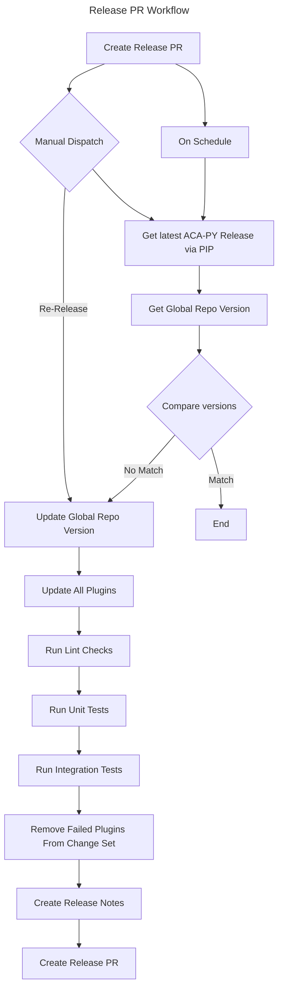

The following is a flowchart of the release workflows...

```mermaid
---
title: Release PR Workflow
---

flowchart TB
    Start[Create Release PR] --> ManualDispatch{Manual Dispatch}
    Start --> OnSchedule[On Schedule]
    ManualDispatch --> GetACAPYRelease[Get latest ACA-PY Release via PIP]
    ManualDispatch --> |Re-Release|UpdateGlobal
    OnSchedule --> GetACAPYRelease
    GetACAPYRelease --> CheckGlobal[Get Global Repo Version]
    CheckGlobal --> Compare{Compare versions}
    Compare --> |Match| End
    Compare --> |No Match| UpdateGlobal[Update Global Repo Version]
    UpdateGlobal --> UpdateAllPlugins[Update All Plugins]
    UpdateAllPlugins --> RunLintChecks[Run Lint Checks]
    RunLintChecks --> RunUnitTests[Run Unit Tests]
    RunUnitTests --> RunIntegrationTests[Run Integration Tests]
    RunIntegrationTests --> RemoveFailedPlugins[Remove Failed Plugins From Change Set]
    RemoveFailedPlugins --> CreateReleaseNotes[Create Release Notes]
    CreateReleaseNotes --> CreateReleasePR[Create Release PR]

```