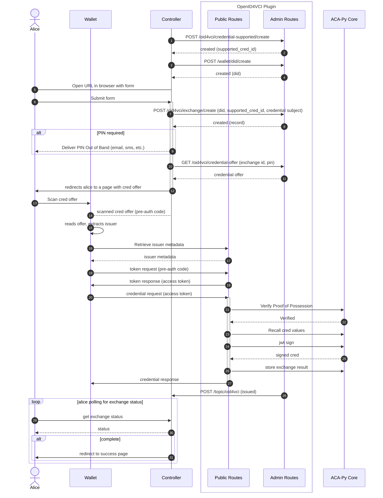
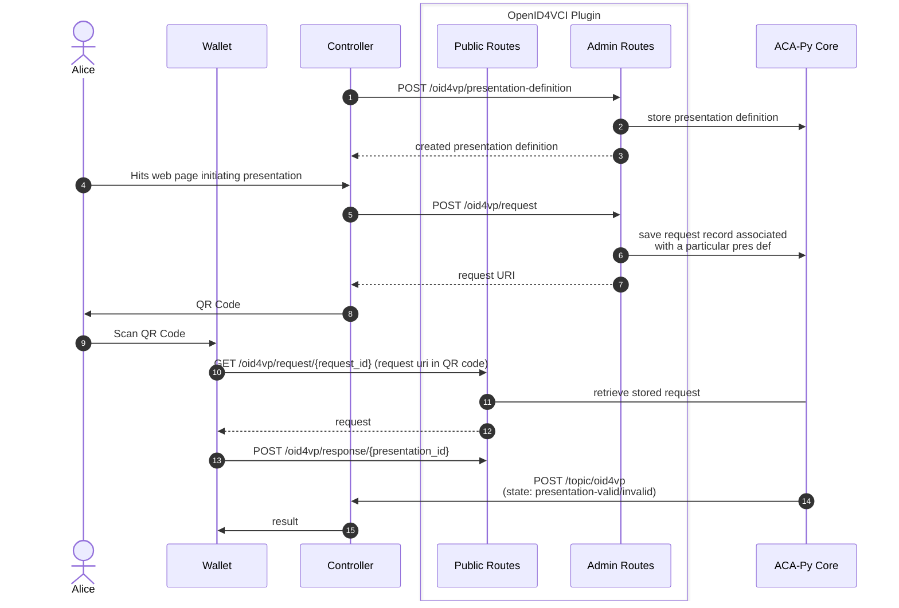

# OpenID4VCI Plugin for ACA-Py

This plugin implements [OpenID4VCI (Draft 11)][oid4vci]. The OpenID4VCI specification is in active development, as is this plugin. Consider this plugin experimental; endpoints and records may change to reflect upstream changes in the specification.

## OpenID4VCI Plugin Demo with Sphereon Wallet

### Demo Overview

This repository showcases a simplified demonstration of the OID4VCI (OpenID for Verifiable Credential Issuers) integration with the [Sphereon Wallet app](https://github.com/Sphereon-Opensource/ssi-mobile-wallet). Follow the steps below to run the demo successfully.

### Prerequisites

- Sphereon Wallet App on your mobile device
- Docker + Docker Compose
- Ngrok Account (free tier is okay)

### Steps to Run the Demo

First, you'll have to get your authtoken from ngrok. Note this value down.

```shell
cd oid4vc/demo
docker-compose build
echo "NGROK_AUTHTOKEN=<PASTE YOUR AUTHTOKEN HERE>" > .env
docker-compose up
docker-compose down -v  # Clean up
```

If you're using Apple Silicon, you may have to separately build the image with the appropriate platform flag (from the `demo` directory):

```sh
DOCKER_DEFAULT_PLATFORM=linux/amd64 docker build -f ../docker/Dockerfile --tag oid4vc ..
```

### Demo Flow

Navigate to `http://localhost:3002` in your browser. You will start at the landing page. The sidebar has buttons to take you to the issuance and presentation pages. 

1. Issue Credential

   - This page generates a simple `UniversityCredential` for issuance
       - The demo obscures and automates the necessary `credential-supported/create` call, which is what defines the type and values of a credential that can be issued

   - Preparing a credential offer is simple:
      - Enter your name and email, or use the test value provided, and hit `Register`
      - Once you hit `Register`, you'll be automatically taken to the Credential Offer Page

2. Credential Offer Page
   - Presents a credential offer in the form of a QR code.
   - Scan the QR code using the Sphereon Wallet app.
   - The Sphereon Wallet follows the OID4VC flow, requesting an authentication token and using it to obtain a credential.
   - The OID4VC plugin determines the credential subjects based on the exchange record.

Now you have a `UniversityCredential` in your Sphereon Wallet. To demonstrate the other half of the OID4VC plugin, click on the `Present Credential` button on the sidebar.

3. Present Credential
   - The Present Credential page has a single button on it: Present Credential
   - When you press that button, the demo will prepare a QR code that contains a presentation request
     - Again, the demo obscures and automates some of the necessary calls to prepare the request, but you can see the calls being made in the logs
   - Scan this QR code with your Sphereon Wallet app
   - Follow the steps on the app, which will prompt you to select a University Credential from your wallet

As mentioned, the demo automatically takes care of a lot of the setup calls necessary to prepare credential definitions, presentation requests, and so forth. You can see what calls are being made, and with what values, both in the container logs and on the page.

### Note

In a production environment, the described processes would be more dynamic and involve additional security measures. This demo provides a streamlined representation for clarity and ease of understanding.

## Architecture


### Public Routes

ACA-Py provides a pluggable mechanism for registering routes for consumption by the controller, the Admin API. This Admin Server makes it trivial to extend the controller from plugins. ACA-Py does not, however, provide a similar mechanism for publicly accessible HTTP Endpoints. Generally speaking, the only public endpoint ACA-Py provides is the DIDComm Messaging endpoint. The OpenID4VCI protocol requires endpoints that are publicly accessible to present and exchange tokens for credentials. This Plugin accomplishes this by starting a separate [aiohttp server](https://docs.aiohttp.org/en/stable/index.html) (similar to how the Admin server is separate from the DIDComm messaging server) and publishes the OpenID4VCI endpoints through this separate server.

Details of the endpoints can be found at `/api/docs` or in the [OpenId4VCI Specification][oid4vci].

### Admin Routes

The plugin exposes Admin API routes for consumption by the Controller to facilitate Credential Issuance over OpenID4VCI. The Admin API Routes can be found under `/api/docs` of the Admin Server in the `oid4vci` section.

### Records

The plugin adds two records to ACA-Py, `OID4VCIExchangeRecord` and `SupportedCredential`. The exchange record keeps track of user data use during the exchange. The supported credential record keeps track of information a issuer needs to issue a credential.

### How it works

It is the Controller's responsibility to prepare Credential Issuer Metadata, collect and record details about the credential subject, (optionally) generate and deliver a User PIN to the holder out of band, and to generate and present the credential offer to the holder.

### Credential Issuance


### Credential Presentation


## Usage

### Configuration

The Plugin expects the following configuration options. These options can either be set by environment variable (`OID4VCI_*`) or by plugin config value (`-o oid4vci.*`).

- `OID4VCI_HOST` or `oid4vci.host`
    - Host used for the OpenID4VCI public server
- `OID4VCI_PORT` or `oid4vci.port`
    - Port used for the OpenID4VCI public server
- `OID4VCI_ENDPOINT` or `oid4vci.endpoint`
    - `credential_issuer` endpoint, seen in the Credential Offer
- `OID4VCI_CRED_HANDLER` or `oid4vci.cred_handler`
    - Dict of credential handlers. e.g. `{"jwt_vc_json": "jwt_vc_json"}`

### Creating Supported Credential Records

To issue a credential using OpenID4VCI, the Issuer must first prepare credential issuer metadata including which credentials the Issuer can issue. Below is an example payload to the `POST /oid4vci/credential-supported/create/jwt` endpoint:

```json
{
  "cryptographic_binding_methods_supported": [
    "did"
  ],
  "cryptographic_suites_supported": [
    "ES256K"
  ],
  "display": [
    {
      "name": "University Credential",
      "locale": "en-US",
      "logo": {
        "url": "https://w3c-ccg.github.io/vc-ed/plugfest-1-2022/images/JFF_LogoLockup.png",
        "alt_text": "a square logo of a university"
      },
      "background_color": "#12107C",
      "text_color": "#FFFFFF"
    }
  ],
  "format": "jwt_vc_json",
  "credentialSubject": {
    "degree": {},
    "given_name": {
      "display": [
        {
          "name": "Given Name",
          "locale": "en-US"
        }
      ]
    },
    "gpa": {
      "display": [
        {
          "name": "GPA"
        }
      ]
    },
    "last_name": {
      "display": [
        {
          "name": "Surname",
          "locale": "en-US"
        }
      ]
    }
  },
  "type": [
    "VerifiableCredential",
    "UniversityDegreeCredential"
  ],
  "id": "UniversityDegreeCredential",
  "@context": [
    "https://www.w3.org/2018/credentials/v1",
    "https://www.w3.org/2018/credentials/examples/v1"
  ],
}
```

For the `id`, `format`, `cryptographic_binding_supported`, `cryptographic_suites_supported`, and `display` attributes, see the [OpenID4VCI Specification, Section 10.2.3][oid4vci].

- `type` is a required attribute for JWT-VC (recorded as `types` in the `SupportedCredential.format_data` dictionary), and `credentialSubject` represents display characteristics of the credential only and is not an exhaustive list of the credential attributes. These values are reported in the credential issuer metadata.
- The `@context` of credential to be issued, as well as the `type` are stored in the `SupportedCredential.vc_additional_data` dictionary. These values are NOT reported in the credential issuer metadata.

When the Controller sets up a Supported Credential record using the Admin API, the holder, upon requesting Credential Issuer Metadata, will receive the following information in response:

```json
{
  "credential_issuer": "https://e116-198-91-62-58.ngrok.io/",
  "credential_endpoint": "https://e116-198-91-62-58.ngrok.io/credential",
  "credentials_supported": [
    {
      "format": "jwt_vc_json",
      "cryptographic_binding_methods_supported": [
        "did"
      ],
      "cryptographic_suites_supported": [
        "ES256K"
      ],
      "display": [
        {
          "name": "University Credential",
          "locale": "en-US",
          "logo": {
            "url": "https://w3c-ccg.github.io/vc-ed/plugfest-1-2022/images/JFF_LogoLockup.png",
            "alt_text": "a square logo of a university"
          },
          "background_color": "#12107c",
          "text_color": "#FFFFFF"
        }
      ],
      "id": "UniversityDegreeCredential",
      "credentialSubject": {
        "degree": {},
        "given_name": {
          "display": [
            {
              "name": "Given Name",
              "locale": "en-US"
            }
          ]
        },
        "gpa": {
          "display": [
            {
              "name": "GPA"
            }
          ]
        },
        "last_name": {
          "display": [
            {
              "name": "Surname",
              "locale": "en-US"
            }
          ]
        }
      },
      "types": [
        "VerifiableCredential",
        "UniversityDegreeCredential"
      ]
    }
  ]
}
```

## Contributing

This project is managed using Poetry. To get started:

```shell
poetry install
poetry run pre-commit install
poetry run pre-commit install --hook-type commit-msg
```

> TODO: Pre-commit should move to the repo root

### Unit Tests

To run unit tests:

```shell
# Run only unit tests; leaving off the directory will attempt to run integration tests
poetry run pytest tests/
```

### Integration Tests

This plugin includes two sets of integration tests:

- Tests against a minimal OpenID4VCI Client written in Python
- Interop Tests against Credo and Sphereon
  - The interop tests require an https endpoint, so they aren't run with the regular integration tests. See `integration/README.md` for instructions on running the interop tests

To run the integration tests:

```shell
cd oid4vc/integration
docker compose build
docker compose run tests
docker compose down -v  # Clean up
```

For Apple Silicon, the `DOCKER_DEFAULT_PLATFORM=linux/amd64` environment variable will be required.

## Not Implemented

- `ldp_vc`
- Authorization Code Flow
- GET /.well-known/openid-configuration
- GET /.well-known/oauth-authorization-server
- Batch Credential Issuance
- We're limited to DID Methods that ACA-Py supports for issuance (more can be added by Plugin, e.g. DID Web); `did:sov`, `did:key`

[oid4vci]: https://openid.net/specs/openid-4-verifiable-credential-issuance-1_0-11.html
