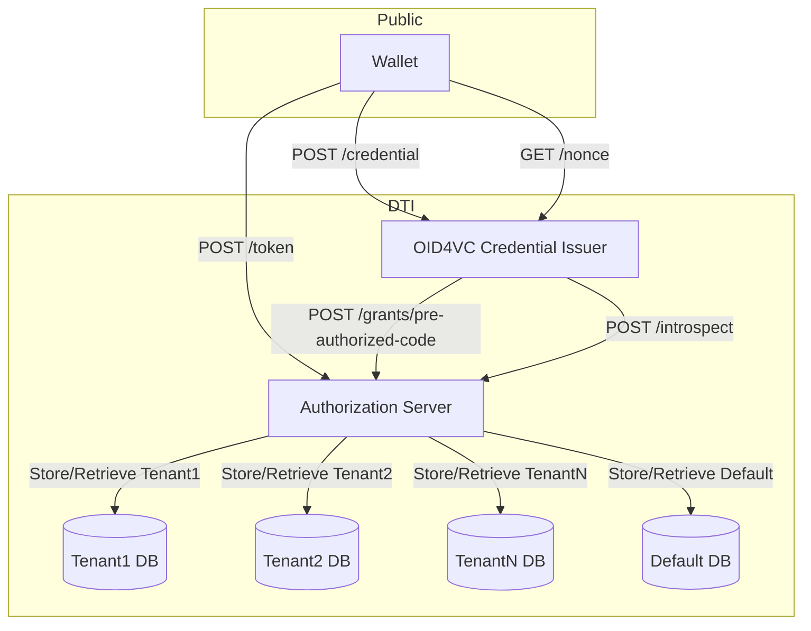
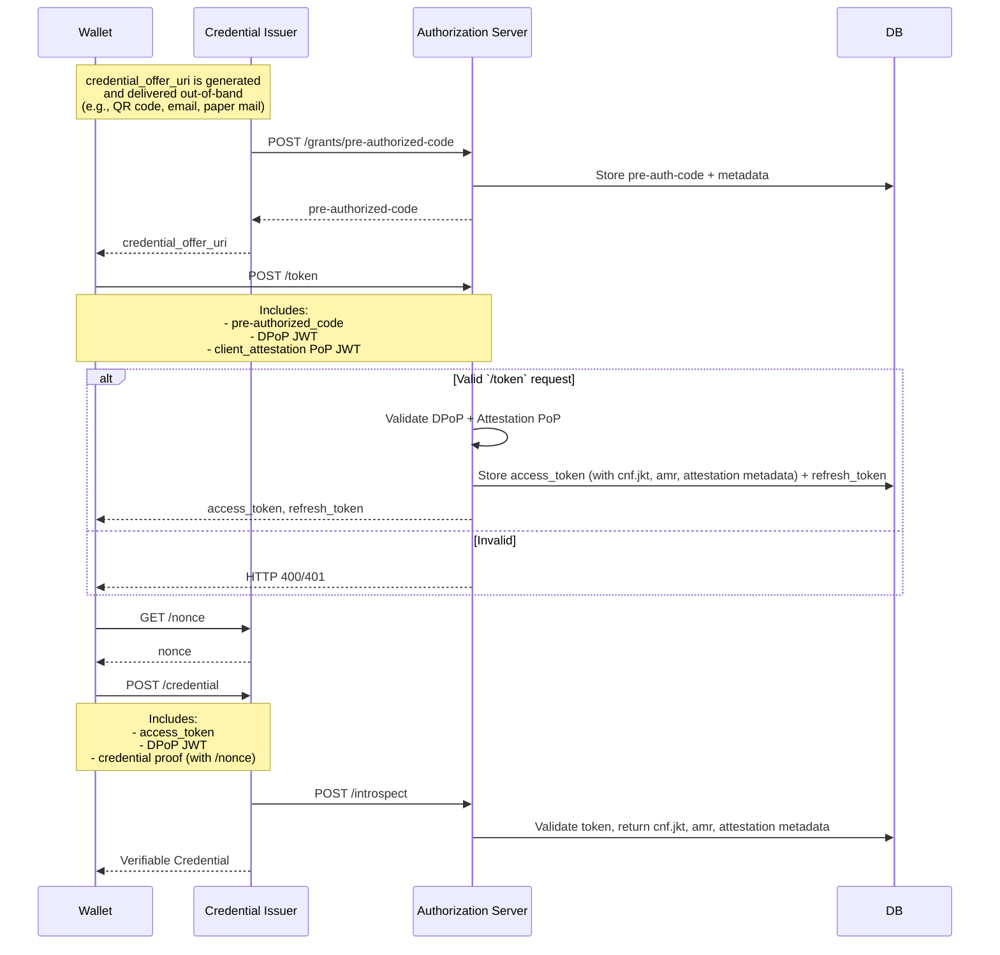
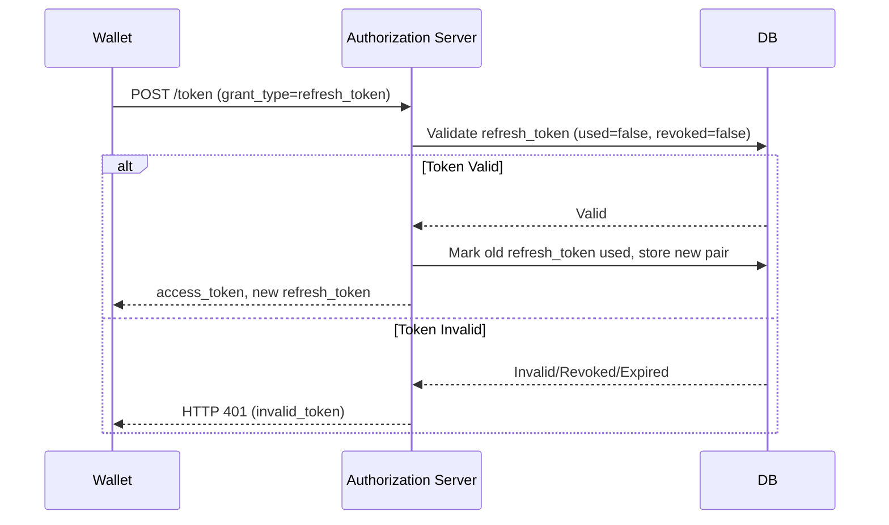
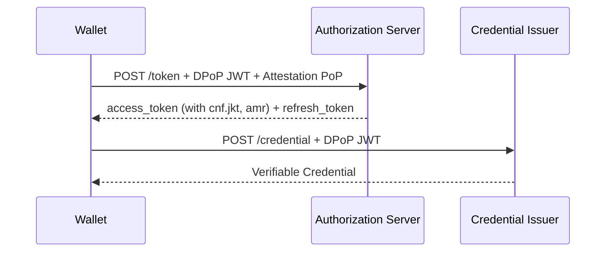
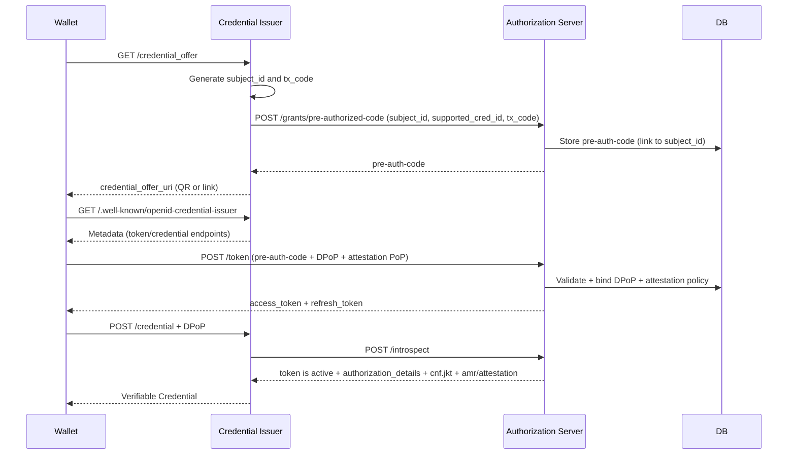
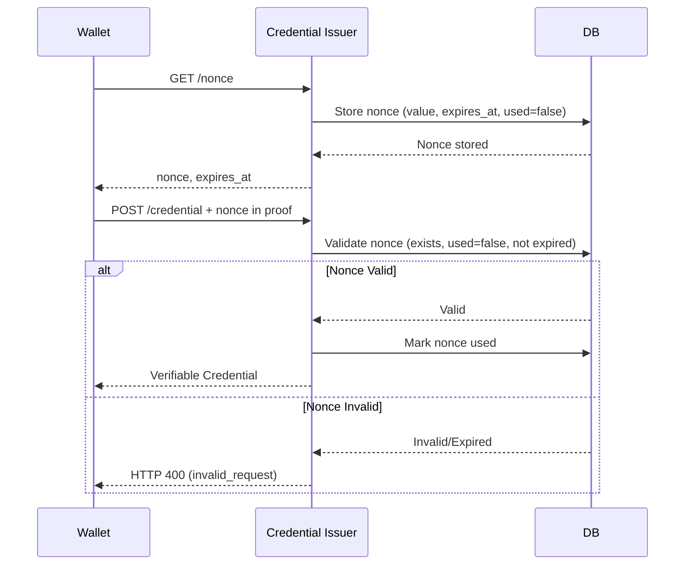
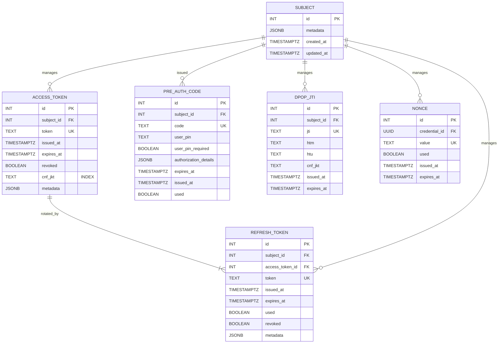

# OpenID for Verifiable Credential Issuance with Authorization Server

> Reference implementation of OID4VCI-compliant issuance with a decoupled Authorization Server

## 📌 Overview

This project delivers a **modular, production-ready Authorization Server** purpose-built for **OpenID for Verifiable Credential Issuance (OID4VCI)** workflows.

While the existing OID4VCI Credential Issuer handled prototype-grade authorization internally, this work cleanly separates that responsibility by introducing a **dedicated Authorization Server (AS)**. The Issuer is now focused solely on credential generation, while **all access control, grant issuance, token validation, and attestation PoP verification** are delegated to the AS.

This system supports **secure, standards-aligned issuance of Verifiable Credentials (VCs)** and is designed for integration with modern digital wallets. It includes:

- 🔐 **Pre-Authorized Code Flow** – Enables issuance without user login
- 🛡️ **DPoP-bound Access Tokens** – Proof-of-possession enforcement ([RFC 9449](https://www.rfc-editor.org/rfc/rfc9449.html))
- 📄 **Authorization Details** – Credential-specific authorization rules ([RFC 9396](https://www.rfc-editor.org/rfc/rfc9396.html))
- 🧾 **Attestation PoP** – Verified by the Authorization Server using attestation PoP JWT presented by the wallet
- 🔁 **Refresh Token Rotation** – Mitigates token reuse and supports long-lived sessions
- 🧠 **Token Introspection** – Fine-grained validation with embedded credential metadata
- 🌐 **Metadata Discovery** – Standards-based wallet interoperability via `.well-known` endpoints

### 🔧 Core Components

- **Authorization Server** (FastAPI + Authlib)
- **Credential Issuer** with delegated authorization and introspection integration
- **PostgreSQL** for persistence of grants, tokens, and credential metadata
- **Support for DPoP, Authorization Details, Attestation PoP, Refresh Token rotation**

This architecture separates concerns, improves security, enhances extensibility, and provides a scalable foundation for OID4VCI credential issuance in production environments.

---

## 🔗 Multi-Tenancy

The system supports multi-tenancy for data isolation in OID4VCI workflows. The Credential Issuer and Authorization Server use a **database-per-tenant** model, where each tenant has a dedicated PostgreSQL database with the same schema (e.g., `SUBJECT`, `ACCESS_TOKEN`).

**Key Features**:

- **Database-Per-Tenant Model**:

  - Each tenant (identified by `tenant-id`) maps to a separate database (e.g., `tenant1_db`).
  - In single-tenant deployments, non-prefixed endpoints like `/token` and `/credential` implicitly use the default tenant (`default_db`).
  - All tenant databases use the same schema version via Alembic migrations.
  - Enforcement: Tokens must only be used in the context of their issuing tenant. Cross-tenant use returns HTTP 401 (`invalid_token`).

- **Tenant Configuration**:

  - Mappings stored in a configuration file or central store:

    | Tenant ID | Database URL                  |
    | --------- | ----------------------------- |
    | tenant1   | `postgresql://.../tenant1_db` |
    | tenant2   | `postgresql://.../tenant2_db` |
    | default   | `postgresql://.../default_db` |

- **Endpoint Structures**:

  - Multi-Tenant: Prefix with `/tenants/{tenant-id}/` (e.g., `/tenants/tenant1/token`).
  - Single-Tenant: Use non-prefixed endpoints (e.g., `/token`).

- **Token Scoping**:

  - Tokens include a realm claim (e.g., `"realm": "tenant1"`).
  - Validation ensures realm matches request context during introspection.

- **Security and Isolation**:

  - Physical separation prevents cross-tenant leakage.
  - Tenant-specific DB credentials and CORS restrictions.
  - Errors: `400 invalid_tenant` – Tenant not found.

- **Provisioning and Maintenance**:
  - Automate with scripts (e.g., `CREATE DATABASE tenant1_db;` then schema migration).
  - Migrations: Use Alembic to apply changes across databases.
  - Monitoring: Per-tenant performance monitoring with tools like `pg_stat_activity`.

---

## 🛠️ Key Features & Requirements Mapping

| #   | Feature                      | Component            | Description                                              |
| --- | ---------------------------- | -------------------- | -------------------------------------------------------- |
| 1   | Credential update & re-issue | Credential Issuer    | Revoked credential can be reissued; old version deleted. |
| 2   | Credential cleanup           | Cron + DB            | Periodic cleanup of expired credentials.                 |
| 3   | Refresh Token issued         | Auth Server          | Every access token comes with a refresh token.           |
| 4   | Refresh Token rotation       | Auth Server          | One-time-use refresh tokens; replaced with each request. |
| 5   | Decoupled authorization      | Auth Server + Config | Tokens validated externally or by config-swappable AS.   |
| 6   | Attestation verification     | Authorization Server | Verify `client_attestation` PoP JWT at `/token`          |
| 7   | `/nonce` endpoint            | Credential Issuer    | Required by OID4VCI; prevents nonce reuse.               |

---

## 🧩 Component Architecture



**Note**:

- `credential_offer_uri` is generated and delivered out-of-band (QR code, email, paper mail).\_
- For multi-tenant deployments, endpoints can be prefixed with `/tenants/{tenant-id}/` to route to tenant-specific databases. See the [Multi-Tenancy](#-multi-tenancy) section for details on the database-per-tenant model and token scoping with the `realm` claim.

---

## 🔄 Credential Issuance Flow

Covers:

- Pre-authorized code grant registration
- DPoP
- Attestation PoP
- Token introspection and credential delivery
- Wallet requests a nonce from `/nonce` for credential proof replay protection
- Optional refresh token for subsequent credential requests

### 🧬 Initial Credential Issuance



---

### 🧬 Refresh Token Flow



---

### 🛡️ Enforcement Points

| Component            | Validates                                                                                                                                  |
| -------------------- | ------------------------------------------------------------------------------------------------------------------------------------------ |
| Authorization Server | Pre-auth code; **DPoP JWT** (proof-of-possession); **Attestation PoP JWT** per policy; refresh token rotation (validated for `used=false`) |
| Credential Issuer    | Introspection (active token, realm match); **DPoP match (`cnf.jkt`)**; Nonce proof                                                         |

---

### 📦 Notes

- Attestation PoP is verified by the Authorization Server at `/token`.
- DPoP `jkt` thumbprint is stored in `access_token.cnf_jkt`, and enforced by both the AS (at `/token`) and Issuer (at `/credential`).
- The Issuer uses `/introspect` to validate the access token and retrieve embedded claims (e.g., `cnf.jkt`, `amr`, and `attestation` metadata), then performs its own DPoP check.
- Wallets **do not** send attestation to `/credential`; it’s only relevant at `/token`.

---

## 🧾 Attestation PoP

**Purpose:** Provide an additional verifiable PoP signal at `/token`, without any interaction with external attestation providers.

### Flow

1. **Client Attestation PoP JWT (policy-driven)**

   - Issued by the wallet provider and signed.
   - Contains claims the Auth Server can verify (e.g., `iss`, `sub`, `iat`, `exp`, a key-binding claim).

2. **Verification (Authorization Server)**

   - Validate signature and required claims.
   - Optionally bind to the same key used for DPoP by matching a thumbprint (`jkt`) claim.
   - Apply trust policy: `auto_trust`, `allow_list`, or `deny_list`.

3. **Outcome**
   - If policy requires attestation PoP and verification fails → `invalid_attestation`.
   - On success, record outcome in `ACCESS_TOKEN.metadata` and add `"att-pop"` to `amr`.

### Example `/token` Request (with Attestation PoP)

```http
POST /token
Content-Type: application/x-www-form-urlencoded
DPoP: <signed DPoP JWT>

grant_type=urn:ietf:params:oauth:grant-type:pre-authorized_code&
pre-authorized_code=abc123&
client_attestation=eyJhbGciOiJSUzI1NiIs...
```

### Trust Policy Modes

- **auto_trust** – Accept any syntactically valid, verifiable PoP JWT.
- **allow_list** – Accept only if (`sub`, optional `jkt`) pair appears in a configured list.
- **deny_list** – Explicitly reject known-bad `sub` (and/or `jkt`).

**Errors (Auth Server):**

- `invalid_attestation` – Missing/malformed/expired/failed verification.
- `invalid_request` – Violates trust policy.

---

## 🔐 DPoP (Demonstration of Proof-of-Possession)

### ✅ Overview

DPoP ensures that access tokens are bound to a client’s private key, preventing unauthorized use of stolen tokens (RFC 9449).

### ✅ Support

- **Required for `/token` and `/credential`**.
- Access tokens include a `cnf.jkt` claim (JWK Thumbprint) binding the token to the client’s DPoP key.
- Replay protection via `jti` on DPoP JWTs.

### 🧬 Token Binding Flow with DPoP



### 🛠️ Implementation Steps

1. Client generates DPoP key pair (public JWK appears in `DPoP` header).
2. Client sends DPoP header with `/token`.
3. Auth Server validates signature, `htu`/`htm`, and `jti` uniqueness; derives `cnf.jkt`.
4. Issued access token contains `cnf.jkt`.
5. Issuer enforces DPoP on `/credential` by matching request DPoP proof to `cnf.jkt`.

---

## 🔄 RFC 7591/7592: Dynamic Client Registration

The Credential Issuer, acting on behalf of a trusted program owner, performs client registration internally when generating a credential offer. It ensures:

- Only authorized credential offers are issued
- Wallets are provisioned with appropriate scopes and authorization context
- Client metadata is linked to the credential issuance transaction (e.g., `tx_code`, `supported_cred_id`)

The Credential Issuer registers the subject of the credential using `subject_id` (UUID or another privacy-preserving identifier).



---

## 🔐 Nonce Replay Prevention Controls

To prevent replay attacks in the credential issuance process, the `/nonce` endpoint provides a unique, time-bound nonce for use in the `/credential` request proof. Controls:

- Nonces are stored in the `NONCE` table with a unique `value`, `used` flag, and `expires_at`. The `credential_id` links to the `SUBJECT.subject_id` (UUID).
- The Issuer validates that the nonce exists, is unused, and unexpired; then marks it `used`.
- Invalid/expired → HTTP 400 `invalid_request`.
- Periodic cleanup of expired nonces.
- Rate limit `/nonce` (e.g., 10 req/min/IP).

**Nonce Flow**



---

## 📘 API Endpoints

### Authorization Server

| Endpoint                            | Method | Auth              | Description                          |
| ----------------------------------- | ------ | ----------------- | ------------------------------------ |
| `/token`                            | POST   | DPoP + att PoP    | Token exchange (pre-auth or refresh) |
| `/introspect`                       | POST   | ClientId + Secret | Token validation + attestation       |
| `/grants/pre-authorized-code`       | POST   | ClientId + Secret | Issue a pre-authorized code grant.   |
| `/.well-known/openid-configuration` | GET    | None              | Auth Server metadata discovery       |

### Credential Issuer

| Endpoint                                | Method | Auth          | Description                      |
| --------------------------------------- | ------ | ------------- | -------------------------------- |
| `/credential_offer`                     | GET    | None          | Offer URI with pre-auth code     |
| `/credential`                           | POST   | Bearer + DPoP | Request VC                       |
| `/nonce`                                | GET    | None          | Nonce for credential proof       |
| `/.well-known/openid-credential-issuer` | GET    | None          | OID4VC Issuer metadata discovery |

---

### 🔐 `POST /token`

Exchanges a pre-authorized code or refresh token for an access token (and new refresh token for rotation). If policy requires attestation PoP, the request must include `client_attestation`.

**Request**

```http
POST /token
Content-Type: application/x-www-form-urlencoded
DPoP: <signed DPoP JWT>

grant_type=urn:ietf:params:oauth:grant-type:pre-authorized_code&
pre-authorized_code=abc123&
user_pin=1234&
client_attestation=eyJhbGciOiJSUzI1NiIs...
```

**Response**

```json
{
  "access_token": "eyJhbGciOi...",
  "refresh_token": "xyz456",
  "token_type": "Bearer",
  "expires_at": "iso-8601-datetime",
  "scope": "openid vc_authn vc_business_card",
  "authorization_details": [
    {
      "type": "openid_credential",
      "format": "vc+sd-jwt",
      "types": ["VerifiableCredential", "OntarioBusinessCard"]
    }
  ],
  "cnf": { "jkt": "base64url-encoded-thumbprint" },
  "amr": ["dpop", "att-pop"]
}
```

**Errors**

- HTTP 400 `invalid_request`: Invalid pre-authorized code, DPoP JWT, malformed attestation PoP.
- HTTP 401 `invalid_token`: Invalid or revoked refresh token.
- HTTP 401 `invalid_attestation`: Attestation PoP required by policy but missing or failed verification.

---

### 📤 `POST /introspect`

Used by the Credential Issuer to verify tokens before releasing credentials. Includes attestation outcome metadata when present.

**Request**

```http
POST /introspect
Authorization: Basic base64(client_id:client_secret)
Content-Type: application/x-www-form-urlencoded

token=eyJhbGciOiJSUzI1NiIsInR5cCI6IkpXVCJ9...
token_type_hint=access_token
```

**Response**

```json
{
  "active": true,
  "scope": "openid vc_authn vc_business_card",
  "subject_id": "c26fe7f5-6bd8-41c5-b0af-c2f555ec89f7",
  "token_type": "Bearer",
  "exp": 1721031600,
  "iat": 1721028000,
  "sub": "did:example:abcd1234",
  "authorization_details": [
    {
      "type": "openid_credential",
      "format": "vc+sd-jwt",
      "types": ["VerifiableCredential", "OntarioBusinessCard"]
    }
  ],
  "cnf": { "jkt": "QmFzZTY0ZW5jb2RlZFRodW1icHJpbnQ=" },
  "iss": "https://auth.example.com",
  "realm": "tenant1",
  "amr": ["dpop", "att-pop"],
  "attestation": {
    "present": true,
    "verified": true,
    "policy": "allow_list",
    "decision": "trusted",
    "jkt": "QmFzZTY0ZW5jb2RlZFRodW1icHJpbnQ=",
    "sub": "wallet.app.id:123",
    "hash": "sha256:2f1c...ab",
    "iat": 1721028000,
    "exp": 1721031600
  }
}
```

**Errors**

- HTTP 401 `invalid_client`: Invalid client credentials.
- HTTP 400 `invalid_request`: Invalid token or token type hint.

---

### 📤 `POST /credential`

Request a credential using an access token. (No attestation here; enforced at `/token`).

**Request**

```http
POST /credential
Authorization: Bearer eyJhbGciOi...
DPoP: <signed DPoP JWT>
Content-Type: application/json

{
  "format": "vc+sd-jwt",
  "type": "OntarioBusinessCard",
  "proof": { "proof_type": "jwt", "jwt": "eyJ0eXAiOiJKV1Q..." }
}
```

**Response**

```json
{
  "format": "vc+sd-jwt",
  "credential": "eyJhbGciOiJFZERTQSJ9...sig"
}
```

**Errors**

- HTTP 400 `invalid_request`: Invalid access token, DPoP JWT, or nonce proof.

---

### 🪪 `GET /credential_offer`

Returns the credential offer URI with embedded pre-authorized code.

**Request**

```http
GET /credential_offer
```

**Response**

```json
{
  "credential_offer_uri": "openid-credential-offer://?credential_offer=..."
}
```

Decoded `credential_offer`:

```json
{
  "credential_offer": {
    "credential_issuer": "https://issuer.example.com",
    "grants": {
      "urn:ietf:params:oauth:grant-type:pre-authorized_code": {
        "pre-authorized_code": "abc123",
        "user_pin_required": false
      }
    },
    "authorization_details": [
      {
        "type": "openid_credential",
        "format": "vc+sd-jwt",
        "types": ["VerifiableCredential", "OntarioBusinessCard"]
      }
    ]
  }
}
```

---

### 🔄 `GET /nonce`

Provides a unique, time-bound nonce for the `/credential` proof to prevent replay attacks. See [Nonce Replay Prevention Controls](#-nonce-replay-prevention-controls).

**Request**

```http
GET /nonce
```

**Response**

```json
{
  "nonce": "123456789abcdef",
  "expires_at": "iso-8601-datetime"
}
```

**Errors**

- HTTP 429 `too_many_requests` if rate limit is exceeded.

---

### 🔄 `GET /.well-known/openid-credential-issuer`

**Request**

```http
GET /.well-known/openid-credential-issuer
```

**Response**

```json
{
  "credential_issuer": "https://issuer.example.com",
  "authorization_server": "https://auth.example.com",
  "token_endpoint": "https://auth.example.com/token",
  "credential_endpoint": "https://issuer.example.com/credential",
  "nonce_endpoint": "https://issuer.example.com/nonce",
  "nonce_lifetime": 300,
  "credentials_supported": {
    "OntarioBusinessCard": {
      "format": "vc+sd-jwt",
      "proof_types_supported": ["jwt"],
      "cryptographic_binding_methods_supported": ["did"],
      "cryptographic_suites_supported": ["ES256"]
    }
  }
}
```

### 🔄 `GET /.well-known/openid-configuration`

**Request**

```http
GET /.well-known/openid-configuration
```

**Response**

```json
{
  "issuer": "https://auth.example.com",
  "token_endpoint": "https://auth.example.com/token",
  "token_endpoint_auth_methods_supported": ["none"],
  "grant_types_supported": [
    "urn:ietf:params:oauth:grant-type:pre-authorized_code",
    "refresh_token"
  ],
  "authorization_details_types_supported": ["openid_credential"],
  "jwks_uri": "https://auth.example.com/jwks",
  "introspection_endpoint": "https://auth.example.com/introspect"
}
```

### 🔍 Error Handling

- Standard OAuth2 errors: `invalid_token`, `expired_token`, `invalid_grant`, etc.
- DPoP errors: `invalid_dpop_proof`, `replay_detected`.
- Nonce errors: `invalid_request` for invalid/expired nonces; `too_many_requests` for exceeding rate limits.
- Attestation errors: `invalid_attestation` or `invalid_request` if `client_attestation` is missing/invalid or fails policy.

---

## 🗄️ Database Schema Diagram

This project uses PostgreSQL. Conventions:

- Singular table names.
- Timestamps (`created_at`, `updated_at`) using `TIMESTAMPTZ`.
- Foreign Keys with `ON DELETE CASCADE` where appropriate.
- Indexing on key lookup fields.



**Note**: ACCESS_TOKEN.metadata may include amr and attestation outcome.

---

## 🛡️ Enhancements & Security Notes

- **Logging**: Audit issuance, revocation, refresh events, and attestation outcomes.
- **Rate Limiting**: Throttle abuse or brute-force attempts.
- **Token Format**: Access tokens are JWTs with claims (`aud`, `exp`, `cnf`, `amr`, etc.).
- **DPoP Key Lifecycle**: Clients manage DPoP key pairs; rotate if compromised.
- **CORS**: Restrict cross-origin requests where applicable.

## 📘 Terminology

- **JWT (JSON Web Token)**: A compact, signed token format (RFC 7519).
- **JWK (JSON Web Key)**: JSON representation of a cryptographic key (RFC 7517).
- **JKT (JWK Thumbprint)**: Base64url-encoded hash of a JWK (RFC 7638). Used in DPoP and, optionally, in attestation PoP binding.
- **JTI (JWT ID)**: Unique ID for a JWT, used for replay prevention in DPoP flows.
- **DPoP**: Mechanism to bind access tokens to a client’s key (RFC 9449).
- **Attestation PoP**: JWT from the wallet, verified by the Authorization Server to assert client/app properties under a trust policy.
- **Pre-authorized Code**: One-time-use code issued by the AS to enable issuance without user login.
- **Realm**: Logical identifier mapping a token to a specific tenant.
