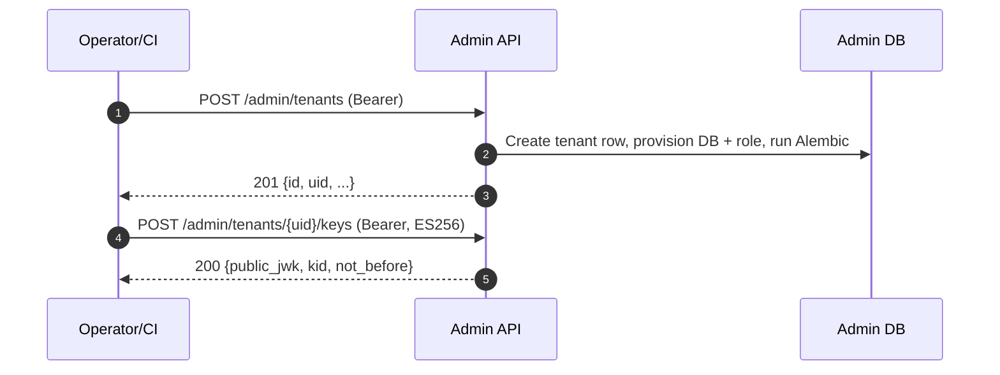
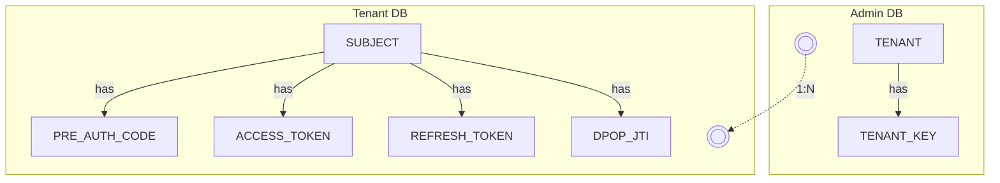

# 📘 Admin Guide

- 👥 Audience: platform operators, CI/CD, and integrators
- 📦 Scope: tenant lifecycle, security, onboarding, and APIs

## 🏛️ Architecture

- High-level: Admin API (control plane) and Tenant API (data plane) with multitenancy via database‑per‑tenant isolation.
- Details: see `docs/auth-server-design.md`

## 🔐 Security Model

- Current:
  - Admin tenants/migrations: Bearer token
  - Admin internal: Bearer token (to be replaced)
- Roadmap:
  - Admin tenants/migrations → OIDC (via an identity provider)
  - Admin internal → private_key_jwt (client assertion with replay protection)

## ⚙️ Bootstrap: Initialize Admin DB

- ⚙️ Configure `.env.admin` with admin database settings (driver, host, user, password, name, schema).
- 🛠️ Initialize schema via Alembic (defaults to `upgrade head`):

```
python alembic/admin/migrate.py
```

- 🧩 Optional overrides:
  - 🔧 `ALEMBIC_DB_URL`, `ALEMBIC_DB_SCHEMA` to override connection and schema
  - 📝 `ALEMBIC_ARGS` to pass Alembic commands (e.g., `upgrade head`, `downgrade -1`)

## 🚀 Onboarding Flow

- ✳️ Create tenant → provision DB/user → run migrations → generate signing key.



## 🧩 APIs

### 🔧 Admin

- Tenants
  - GET `/admin/tenants`
  - POST `/admin/tenants`
  - GET `/admin/tenants/{uid}`
  - PATCH `/admin/tenants/{uid}`
  - DELETE `/admin/tenants/{uid}`
  - POST `/admin/tenants/{uid}/keys`
  - PATCH `/admin/tenants/{uid}/keys/{kid}/status` (active | retired | revoked)
  - GET `/admin/tenants/{uid}/clients`
  - POST `/admin/tenants/{uid}/clients`
  - GET `/admin/tenants/{uid}/clients/{client_id}`
  - PATCH `/admin/tenants/{uid}/clients/{client_id}`
  - DELETE `/admin/tenants/{uid}/clients/{client_id}`
- Migrations
  - POST `/admin/tenants/{uid}/migrations`

### 🔑 Key Management

- Selection policy (JWT signing):
  - If a `kid` is provided, the system uses that key only if it is `active` and within its time window `[not_before, not_after)`.
  - If no `kid` is provided, the most recent `active` and time‑valid key is used (ordered by `not_before desc, created_at desc`).
  - Tokens are never issued beyond a key’s `not_after`.
  - Retire keys via: `PATCH /admin/tenants/{uid}/keys/{kid}/status` (active | retired | revoked).

### 🔐 Key Encryption Secrets

- Configure envelope encryption for private keys and DB passwords via environment:
  - `ADMIN_KEY_ENC_SECRETS`: JSON object mapping version → base64url key, e.g. `{ "1": "<b64url>" }`.
  - `ADMIN_KEY_ENC_VERSION`: active version (integer), e.g. `1`.
- Notes:
  - If `ADMIN_KEY_ENC_SECRETS` is omitted or does not contain the active version, secrets are stored as plaintext and a startup warning is logged.
  - Do not set `ADMIN_KEY_ENC_SECRETS` to an empty string; use `{}` or remove the variable.
- Internal Helpers
  - GET `/internal/tenants/{uid}/db`
  - GET `/internal/tenants/{uid}/jwks`
  - POST `/internal/tenants/{uid}/jwts`

## 🗄️ Data Model

- Admin (control metadata): Tenant, TenantKey
- Tenant (per‑tenant data, multitenancy): Subject, PreAuthCode, AccessToken, RefreshToken, DpopJti



## ⚙️ Operations

- Create tenant: `POST /admin/tenants` → `POST /admin/tenants/{uid}/keys`
- Run migrations: `POST /admin/tenants/{uid}/migrations`
- Rotate signing keys: `POST /admin/tenants/{uid}/keys` (status=active/retiring)

## 🧰 Troubleshooting

- 401 on admin routes: verify the configured admin bearer token matches in caller and server
- JWKS empty: ensure a key exists and is active/retiring
- Tenant DB connect errors: verify per-tenant user/password, search_path, and migrations
