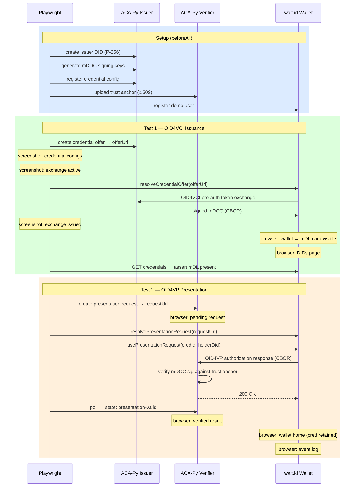

# OID4VC mDOC Demo

End-to-end demo of **OID4VCI v1** credential issuance and **OID4VP v1** presentation
using **mDOC (ISO 18013-5 mDL)** credentials.

| Component | Role |
|---|---|
| **ACA-Py + oid4vc/mso_mdoc plugins** | Issuer and Verifier |
| **walt.id Web Wallet** | Holder — accepts and presents credentials |
| **Playwright** | Optional browser automation for a visual demo |

---

## Prerequisites

- Docker Desktop (with Compose v2)
- Python 3.10+ (for `setup.sh`)
- Node.js 18+ (for the Playwright demo only)

### Apple Silicon (M-series)

walt.id Docker images are `linux/amd64` only. Docker Desktop handles the
x86_64 emulation via Rosetta automatically. ACA-Py runs natively as
`linux/arm64` by default — change `DOCKER_PLATFORM` in `.env` if needed.

---

## Quick start

```bash
# 1. Clone, then enter this directory
cd oid4vc/demo

# 2. Configure (copy example — defaults require no changes for localhost)
cp .env.example .env

# 3. Start all services
docker compose up -d

# 4. Configure ACA-Py (creates DID, mDL credential schema, etc.)
./setup.sh

# 5. Open the wallet in your browser
open http://localhost:7201
```

Register a new account in the wallet and you're ready to go.

---

## Services

| Service | URL | Purpose |
|---|---|---|
| walt.id Web Wallet | <http://localhost:7201> | Holder wallet (browser) |
| ACA-Py Issuer admin | <http://localhost:8121> | Issue credentials |
| ACA-Py Issuer OID4VCI | <http://localhost:8122> | OID4VCI v1 endpoint |
| ACA-Py Verifier admin | <http://localhost:8031> | Verify presentations |
| ACA-Py Verifier OID4VP | <http://localhost:8032> | OID4VP v1 endpoint |

---

## Optional: Playwright visual demo

The `playwright/` directory contains a Playwright script that automates the
full issuance + presentation flow in a visible browser window.

```bash
cd playwright
npm install
npx playwright install chromium

# Run the visual demo (headed — watch it in Chrome)
npx playwright test --headed

# Or headless
npx playwright test
```

### What the demo does

1. **Issues an mDL** — Creates a credential offer on the ACA-Py issuer, then
   accepts it via the wallet API (the wallet stores the mDOC credential).
2. **Shows the credential** — Navigates to the wallet credentials page in
   Chrome so you can see the mDL listed.
3. **Presents the mDL** — Creates an OID4VP presentation request on the
   verifier, navigates to the wallet presentation page, and submits the
   credential to the verifier.

> **Note on the mDOC UI limitation:** The `waltid/waltid-web-wallet:latest`
> image has a known bug where the issuance UI crashes for `mso_mdoc` format
> credentials (it only checks `types`/`vct`, not `doctype`). The wallet
> **backend** handles mDOC correctly, so the Playwright demo accepts
> credentials via the REST API and then opens the browser to display them.
> Track fix progress at <https://github.com/walt-id/waltid-identity>.

---

## External access via zrok (optional)

Use [zrok](https://docs.zrok.io/) to expose the demo over the internet with
an HTTPS endpoint — useful for testing with real mobile wallets.

```bash
# Install zrok and enable (one time)
# https://docs.zrok.io/docs/getting-started

# Reserve permanent tunnel names (one time)
zrok reserve public --unique-name "myissuerapi"   http://localhost:8122
zrok reserve public --unique-name "myverifierapi" http://localhost:8032
zrok reserve public --unique-name "mydemowallet"  http://localhost:7201

# Activate tunnels (each session, in separate terminals)
zrok share reserved myissuerapi
zrok share reserved myverifierapi
zrok share reserved mydemowallet
```

Then add to `.env`:

```env
ISSUER_OID4VCI_ENDPOINT=https://myissuerapi.share.zrok.io
VERIFIER_OID4VP_ENDPOINT=https://myverifierapi.share.zrok.io
WALLET_PUBLIC_URL=https://mydemowallet.share.zrok.io
```

Restart the stack: `docker compose up -d` and re-run `./setup.sh`.

> zrok provides HTTPS automatically — no additional TLS proxy (nginx) is
> needed.  The `nginx.conf` in this directory is only for combining the
> wallet API and frontend on a single port.

---

## Architecture (localhost)

```
┌─────────────────────────────────────────────────────────┐
│  Docker network                                          │
│                                                          │
│  ┌─────────────────┐     OID4VCI v1    ┌─────────────┐  │
│  │  ACA-Py Issuer  │ ◄──────────────── │  walt.id    │  │
│  │  :8121 admin    │                   │  wallet-api │  │
│  │  :8122 OID4VCI  │                   │  :7001      │  │
│  └─────────────────┘                   └─────────────┘  │
│                                              │           │
│  ┌─────────────────┐     OID4VP v1           │           │
│  │  ACA-Py Verifier│ ◄────────────────       │           │
│  │  :8031 admin    │                   ┌─────────────┐  │
│  │  :8032 OID4VP   │                   │  walt.id    │  │
│  └─────────────────┘                   │  web wallet │  │
│                                        │  :7101      │  │
│                                        └─────────────┘  │
└───────────────────────────────┬─────────────────────────┘
                                │  nginx proxy
                         http://localhost:7101
                         (browser / Playwright)
```

---

## Demo flow

The Playwright tests drive the following sequence of API calls and browser
interactions:



> **Why the wallet API instead of the browser UI?**
> The `waltid/waltid-web-wallet:latest` image has known bugs for `mso_mdoc`
> credentials: the issuance UI crashes (checks `types`/`vct`, not `doctype`)
> and the credential detail page crashes (`issuerSigned` null reference).
> The wallet *backend* handles mDOC correctly, so Playwright calls the
> wallet REST API directly for issuance acceptance and presentation
> submission, then opens the browser to show the result pages.

---

## Credential format

| Format | Schema |
|---|---|
| `mso_mdoc` | `org.iso.18013.5.1.mDL` (mobile driving licence) |

> **Note:** `setup.sh` and the Playwright demo use `mso_mdoc` only. A
> `vc+sd-jwt` helper (`TestCredential`) exists in `acapy-client.ts` but is
> not exercised — ACA-Py serialises SD-JWT claims in a path-based array
> format that the walt.id wallet cannot parse.

To issue a credential manually:

```bash
# Get the credential config IDs
curl -s http://localhost:8121/oid4vci/credential-supported/list | python3 -m json.tool

# Create an offer (replace <did> and <config_id>)
curl -s -X POST http://localhost:8121/oid4vci/exchange/create \
  -H "Content-Type: application/json" \
  -d '{
    "supported_cred_id": "<config_id>",
    "did": "<did>",
    "credential_subject": {
      "org.iso.18013.5.1": {
        "given_name": "Alice",
        "family_name": "Holder",
        "birth_date": "1990-01-01",
        "issuing_country": "US",
        "issuing_authority": "Demo DMV",
        "document_number": "DL-001"
      }
    }
  }'
```

Then paste the `credential_offer` URL into the wallet at
`http://localhost:7201`.

---

## Stopping the demo

```bash
docker compose down          # stop containers
docker compose down -v       # also remove wallet database volumes
```
