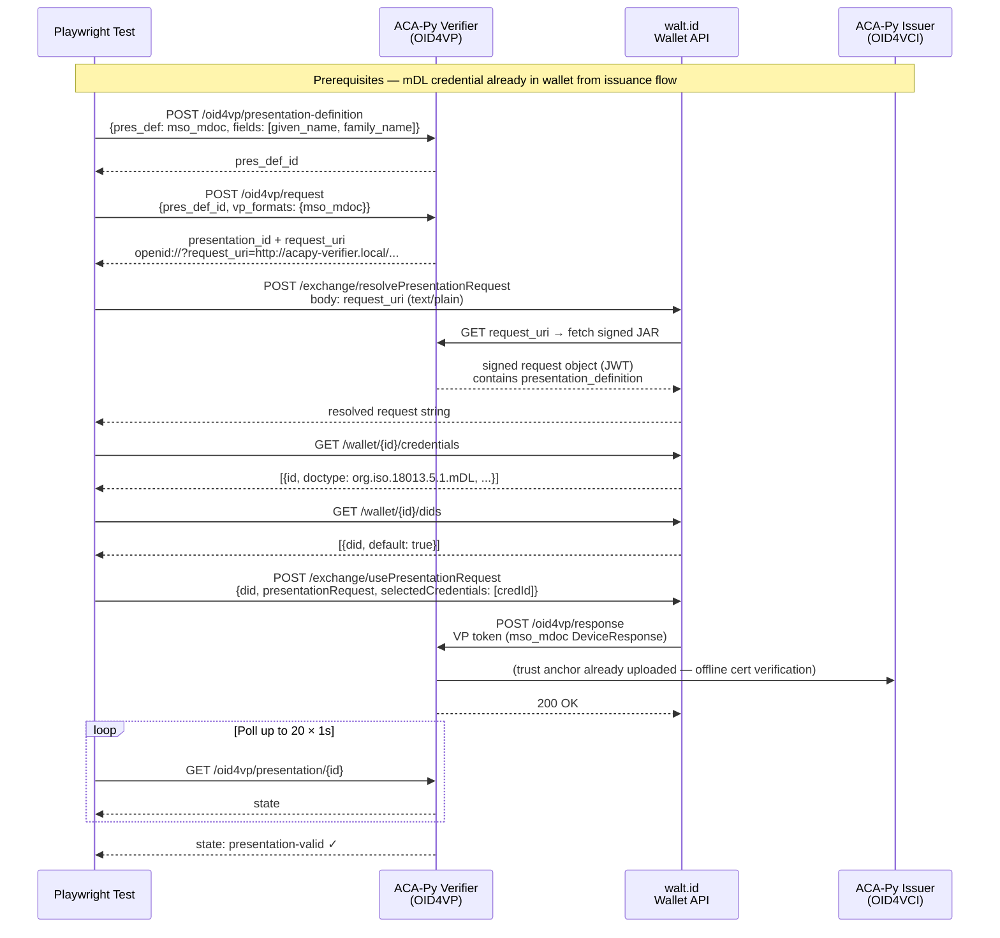

# OID4VP mDL Presentation Flow

```mermaid
sequenceDiagram
    participant PW as Playwright Test
    participant Verifier as ACA-Py Verifier<br/>(OID4VP)
    participant Wallet as walt.id<br/>Wallet API
    participant Issuer as ACA-Py Issuer<br/>(OID4VCI)

    Note over PW,Issuer: Prerequisites — mDL credential already in wallet from issuance flow

    PW->>Verifier: POST /oid4vp/presentation-definition<br/>{pres_def: mso_mdoc, fields: [given_name, family_name]}
    Verifier-->>PW: pres_def_id

    PW->>Verifier: POST /oid4vp/request<br/>{pres_def_id, vp_formats: {mso_mdoc}}
    Verifier-->>PW: presentation_id + request_uri<br/>openid://?request_uri=http://acapy-verifier.local/...

    PW->>Wallet: POST /exchange/resolvePresentationRequest<br/>body: request_uri (text/plain)
    Wallet->>Verifier: GET request_uri → fetch signed JAR
    Verifier-->>Wallet: signed request object (JWT)<br/>contains presentation_definition
    Wallet-->>PW: resolved request string

    PW->>Wallet: GET /wallet/{id}/credentials
    Wallet-->>PW: [{id, doctype: org.iso.18013.5.1.mDL, ...}]

    PW->>Wallet: GET /wallet/{id}/dids
    Wallet-->>PW: [{did, default: true}]

    PW->>Wallet: POST /exchange/usePresentationRequest<br/>{did, presentationRequest, selectedCredentials: [credId]}
    Wallet->>Verifier: POST /oid4vp/response<br/>VP token (mso_mdoc DeviceResponse)
    Verifier->>Issuer: (trust anchor already uploaded — offline cert verification)
    Verifier-->>Wallet: 200 OK

    loop Poll up to 20 × 1s
        PW->>Verifier: GET /oid4vp/presentation/{id}
        Verifier-->>PW: state
    end

    Verifier-->>PW: state: presentation-valid ✓
```
