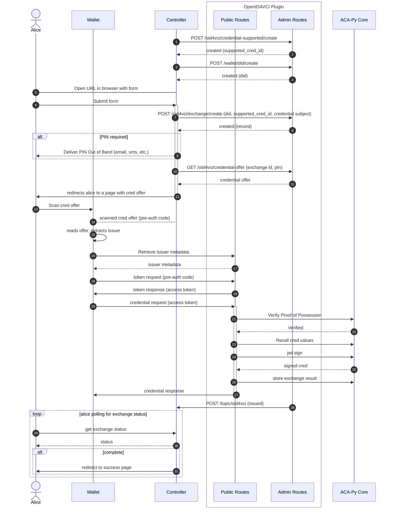

# OpenID4VCI Plugin for ACA-Py

This plugin implements [OpenID4VCI (Draft 11)][oid4vci]. The OpenID4VCI specification is in active development, as is this plugin. Consider this plugin experimental; endpoints and records may change to reflect upstream changes in the specification.

## OpenID4VCI Plugin Demo with Sphereon Wallet

### Demo Overview

This repository showcases a simplified demonstration of the OID4VCI (OpenID for Verifiable Credential Issuers) integration with the [Sphereon Wallet app](https://github.com/Sphereon-Opensource/ssi-mobile-wallet). Follow the steps below to run the demo successfully.

### Prerequisites

- Sphereon Wallet App on your mobile device
- Docker + Docker Compose

### Steps to Run the Demo

```shell
cd oid4vci/demo
docker compose build
docker compose up
docker compose down -v  # Clean up
```

If you're using Apple Silicon, you may have to separately build the image with the appropriate platform flag (from the `demo` directory):

```sh
$ DOCKER_DEFAULT_PLATFORM=linux/amd64 docker build -f ../docker/Dockerfile --tag oid4vci ..
```

### Demo Flow

Navigate to `http://localhost:3002` in your browser. You will start at the registration page.

#### 1. Admin Registration Page
- Demonstrates the issuer's process of registering a new OID4VCI credential type.
- Utilizes the admin API to create a supported credential record for issuance tracking.
- In a production environment, this process is dynamic, but for the demo, it's simplified to a single button click.

#### 2. Input Form Page
- Illustrates the user's initiation of an interaction with an issuer to request a credential.
- The data submited here will end up in the issued credential.

#### 3. Credential Offer Page
- Presents a credential offer in the form of a QR code.
- The Input Form Page uses the admin API to create an exchange record, tracking user information, OID4VCI token, codes, pins, and credential subjects.
- Scan the QR code using the Sphereon Wallet app.
- The Sphereon Wallet follows the OID4VCI flow, requesting an authentication token and using it to obtain a credential.
- The OID4VCI plugin determines the credential subjects based on the exchange record.

### Note
In a production environment, the described processes would be more dynamic and involve additional security measures. This demo provides a streamlined representation for clarity and ease of understanding.
    
## Architecture


### Public Routes
ACA-Py provides a pluggable mechanism for registering routes for consumption by the controller, the Admin API. This Admin Server makes it trivial to extend the controller from plugins. ACA-Py does not, however, provide a similar mechanism for publicly accessible HTTP Endpoints. Generally speaking, the only public endpoint ACA-Py provides is the DIDComm Messaging endpoint. The OpenID4VCI protocol requires endpoints that are publicly accessible to present and exchange tokens for credentials. This Plugin accomplishes this by starting a separate [aiohttp server](https://docs.aiohttp.org/en/stable/index.html) (similar to how the Admin server is separate from the DIDComm messaging server) and publishes the OpenID4VCI endpoints through this separate server.

Details of the endpoints can be found at `/api/docs` or in the [OpenId4VCI Specification][oid4vci].

### Admin Routes
The plugin exposes Admin API routes for consumption by the Controller to facilitate Credential Issuance over OpenID4VCI. The Admin API Routes can be found under `/api/docs` of the Admin Server in the `oid4vci` section.

### Records 
The plugin adds two records to acapy, `OID4VCIExchangeRecord` and `SupportedCredential`. The exchange record keeps track of user data use during the exchange. The supported credential record keeps track of information a issuer needs to issue a credential.

### How it works

It is the Controller's responsibility to prepare Credential Issuer Metadata, collect and record details about the credential subject, (optionally) generate and deliver a User PIN to the holder out of band, and to generate and present the credential offer to the holder.




## Usage
### Configuration

The Plugin expects the following configuration options. These options can either be set by environment variable (`OID4VCI_*`) or by plugin config value (`-o oid4vci.*`).

- `OID4VCI_HOST` or `oid4vci.host`
    - Host used for the OpenID4VCI public server
- `OID4VCI_PORT` or `oid4vci.port`
    - Port used for the OpenID4VCI public server
- `OID4VCI_ENDPOINT` or `oid4vci.endpoint`
    - `credential_issuer` endpoint, seen in the Credential Offer

### Creating Supported Credential Records

To issue a credential using OpenID4VCI, the Issuer must first prepare credential issuer metadata including which credentials the Issuer can issue. Below is an example payload to the `POST /oid4vci/credential-supported/create` endpoint:

```json
{
  "cryptographic_binding_methods_supported": [
    "did"
  ],
  "cryptographic_suites_supported": [
    "ES256K"
  ],
  "display": [
    {
      "name": "University Credential",
      "locale": "en-US",
      "logo": {
        "url": "https://w3c-ccg.github.io/vc-ed/plugfest-1-2022/images/JFF_LogoLockup.png",
        "alt_text": "a square logo of a university"
      },
      "background_color": "#12107C",
      "text_color": "#FFFFFF"
    }
  ],
  "format": "jwt_vc_json",
  "format_data": {
    "credentialSubject": {
      "degree": {},
      "given_name": {
        "display": [
          {
            "name": "Given Name",
            "locale": "en-US"
          }
        ]
      },
      "gpa": {
        "display": [
          {
            "name": "GPA"
          }
        ]
      },
      "last_name": {
        "display": [
          {
            "name": "Surname",
            "locale": "en-US"
          }
        ]
      }
    },
    "types": [
      "VerifiableCredential",
      "UniversityDegreeCredential"
    ]
  },
  "id": "UniversityDegreeCredential",
  "vc_additional_data": {
    "@context": [
      "https://www.w3.org/2018/credentials/v1",
      "https://www.w3.org/2018/credentials/examples/v1"
    ],
    "type": [
      "VerifiableCredential",
      "UniversityDegreeCredential"
    ]
  }
}
```

For the `id`, `format`, `cryptographic_binding_supported`, `cryptographic_suites_supported`, and `display` attributes, see the [OpenID4VCI Specification, Section 10.2.3][oid4vci].

- `format_data`: This attribute represents data specific to a given credential format. In this Supported Credential, which is of format `jwt_vc_json`, this includes `types` (required for JWT-VC) and `credentialSubject` (which represents display characteristics of the credential only and is not an exhaustive list of the credential attributes). These values are reported in the credential issuer metadata.
- `vc_additional_data`: This attribute represents data that is included in all credentials of this type. In this Supported Credential, this includes the `@context` of credential to be issued as well as the `type`. These values are NOT reported in the credential issuer metadata.

When the Controller sets up a Supported Credential record using the Admin API, the holder, upon requesting Credential Issuer Metadata, will receive the following information in response:

```json
{
  "credential_issuer": "https://e116-198-91-62-58.ngrok.io/",
  "credential_endpoint": "https://e116-198-91-62-58.ngrok.io/credential",
  "credentials_supported": [
    {
      "format": "jwt_vc_json",
      "cryptographic_binding_methods_supported": [
        "did"
      ],
      "cryptographic_suites_supported": [
        "ES256K"
      ],
      "display": [
        {
          "name": "University Credential",
          "locale": "en-US",
          "logo": {
            "url": "https://w3c-ccg.github.io/vc-ed/plugfest-1-2022/images/JFF_LogoLockup.png",
            "alt_text": "a square logo of a university"
          },
          "background_color": "#12107c",
          "text_color": "#FFFFFF"
        }
      ],
      "id": "UniversityDegreeCredential",
      "credentialSubject": {
        "degree": {},
        "given_name": {
          "display": [
            {
              "name": "Given Name",
              "locale": "en-US"
            }
          ]
        },
        "gpa": {
          "display": [
            {
              "name": "GPA"
            }
          ]
        },
        "last_name": {
          "display": [
            {
              "name": "Surname",
              "locale": "en-US"
            }
          ]
        }
      },
      "types": [
        "VerifiableCredential",
        "UniversityDegreeCredential"
      ]
    }
  ]
}
```

## Contributing

This project is managed using Poetry. To get started:

```shell
poetry install
poetry run pre-commit install
poetry run pre-commit install --hook-type commit-msg
```

> TODO: Pre-commit should move to the repo root

### Unit Tests

To run unit tests:

```shell
# Run only unit tests; leaving off the directory will attempt to run integration tests
poetry run pytest tests/
```

### Integration Tests

This plugin includes two sets of integration tests:

- Tests against a minimal OpenID4VCI Client written in Python
- Tests against AFJ + OpenID4VCI Client Package (not complete!)

AFJ has an active PR working on adding support for Draft 11 version of the OpenID4VCI specification. Until that PR is in and available in a release, these tests are incomplete and ignored.

To run the integration tests:

```shell
cd oid4vci/int
docker compose build
docker compose run tests
docker compose down -v  # Clean up
```

For Apple Silicon, the `DOCKER_DEFAULT_PLATFORM=linux/amd64` environment variable will be required.

## Not Implemented

- `ldp_vc`, `sd_jwt_vc`
- Authorization Code Flow
- Only signature suite supported by ACA-Py for jwt-vc right now is `EdDSA`
- GET /.well-known/openid-configuration
- GET /.well-known/oauth-authorization-server
- Batch Credential Issuance
- We're limited to DID Methods that ACA-Py supports for issuance (more can be added by Plugin, e.g. DID Web); `did:sov`, `did:key`

[oid4vci]: https://openid.net/specs/openid-4-verifiable-credential-issuance-1_0-11.html
