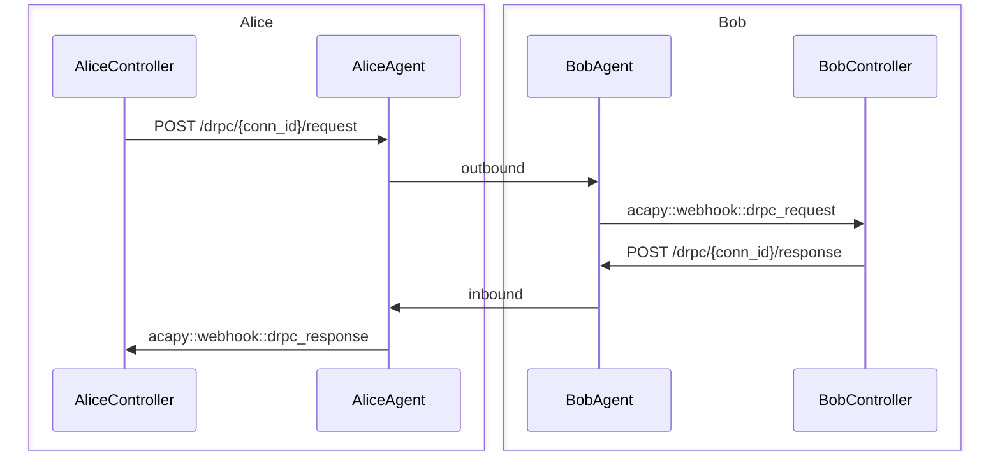
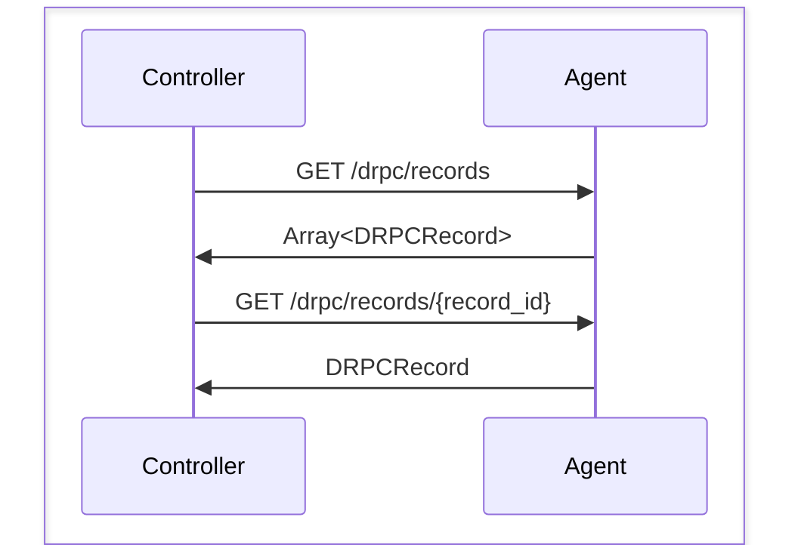

# DIDComm RPC

## Description

DIDComm RPC (DRPC) allows Aries agents to remotely execute methods on each others controllers using JSON-RPC over DIDComm.

- v1_0:
    - Introduces `/drpc/{conn_id}/request` and `/drpc/{conn_id}/response` POST endpoints for sending RPC request and response/error message(s), respectively, according to the specification of RPC request and and response/error objects as defined by [JSON-RPC](https://www.jsonrpc.org/specification).
    - Introduces `/drpc/records` and `/drpc/records/{record_id}` GET endpoints for querying DRPC records stored in Aries agent wallets.

## Configuration

No additional configuration required.

## Sequence

The basic sequence of events in a DRPC interaction are as follows (starting with Alice making a request to Bob and Bob responding accordingly):

Convenience endpoints are also included to retrieve DRPC record information, in case webhook messages somehow don't make it to controllers and the interaction ends up in an incomplete state.

## Additional information

See [Aries RFC 0804](https://github.com/hyperledger/aries-rfcs/blob/bfa0bb23bda457a92a2a37a33b396f43ae84eb03/features/0804-didcomm-rpc/README.md) for more information about the DRPC protocol.