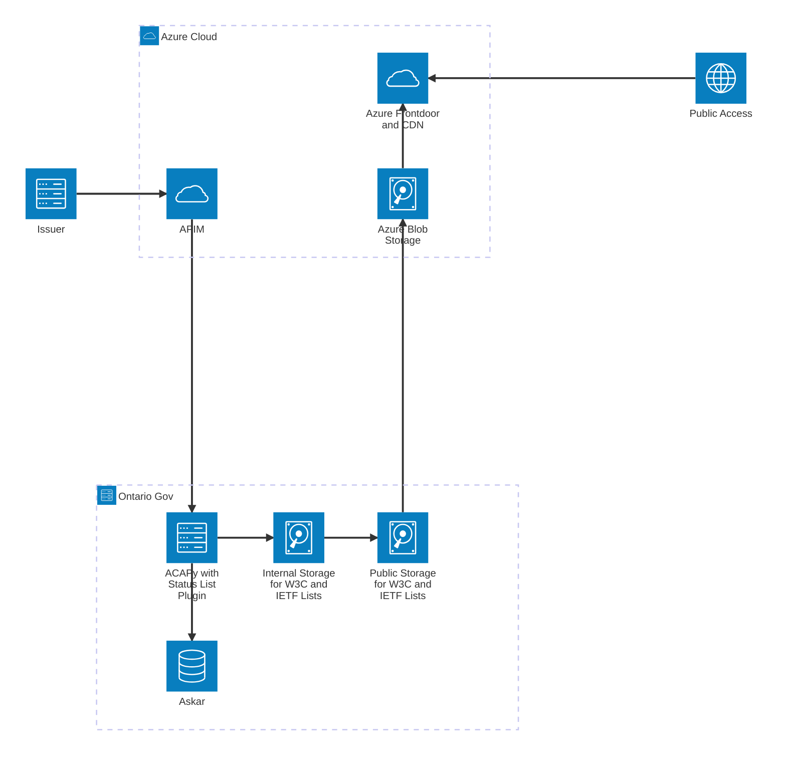
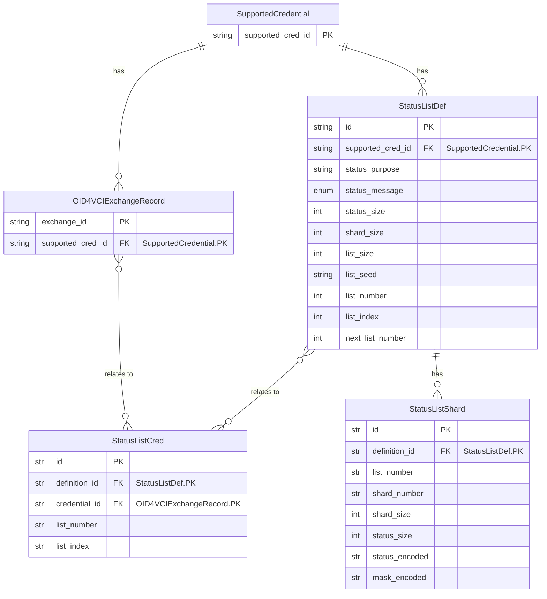
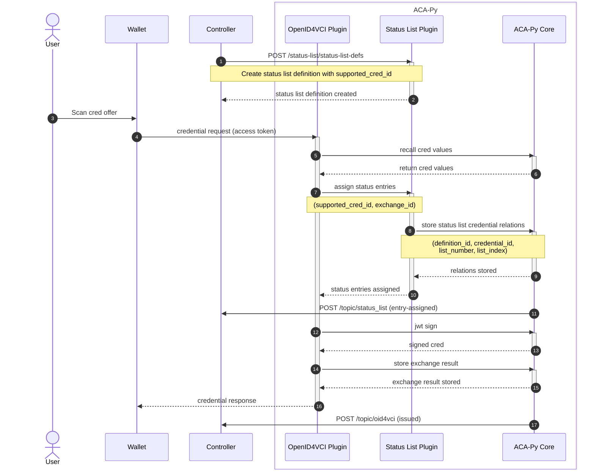
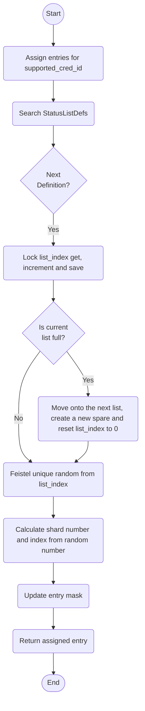

# Status List Plugin for ACA-Py

This plugin implements [W3C Bitstring Status List v1.0](https://www.w3.org/TR/vc-bitstring-status-list/) and [IETF Token Status List](https://datatracker.ietf.org/doc/draft-ietf-oauth-status-list/). The plugin is under active development, please consider this plugin experimental.

## Architecture

### Components


### Data Model


The plugin adds three records to ACA-Py, `StatusListDef`, `StatusListShard` and `StatusListCred`.

### Admin Routes

The Admin API Routes can be found under `/api/docs` of the Admin Server in the `status-list` section.

### How it works

#### Credential Issuance



#### Status List Assignment

When a new status list definition is created, two status lists are generated simultaneously. The assignment flow outlined below assumes this behavior.



## Usage

### Configuration

The Plugin expects the following configuration options. These options can either be set by environment variable (`STATUS_LIST_*`) or by plugin config value (`-o status_list.*`).

- `STATUS_LIST_SIZE` or `status_list.list_size`
    - Number of status entries of the status list
- `STATUS_LIST_SHARD_SIZE` or `status_list.shard_size`
    - Number of status entries of each shard
- `STATUS_LIST_BASE_URL` or `status_list.base_url`
    - Base URL of published status lists
- `STATUS_LIST_BASE_DIR` or `status_list.base_dir`
    - Base directory of the local storage
- `STATUS_LIST_PATH_TEMPLATE` or `status_list.path_template`
    - Template string format of status list's sub path

## Contributing

This project is managed using Poetry. To get started:

```shell
poetry install
poetry run pre-commit install
poetry run pre-commit install --hook-type commit-msg
```

### Unit Tests

To run unit tests:

```shell
poetry run pytest tests/
```

### Integration Tests

This plugin includes two sets of integration tests:

- Tests against a minimal OpenID4VCI Client written in Python
- Tests against AFJ + OpenID4VCI Client Package (not complete!)

AFJ has an active PR working on adding support for Draft 11 version of the OpenID4VCI specification. Until that PR is in and available in a release, these tests are incomplete and ignored.

To run the integration tests:

```shell
cd status_list/integration
docker compose build
docker compose run tests
docker compose down -v  # Clean up
```

For Apple Silicon, the `DOCKER_DEFAULT_PLATFORM=linux/amd64` environment variable will be required.
