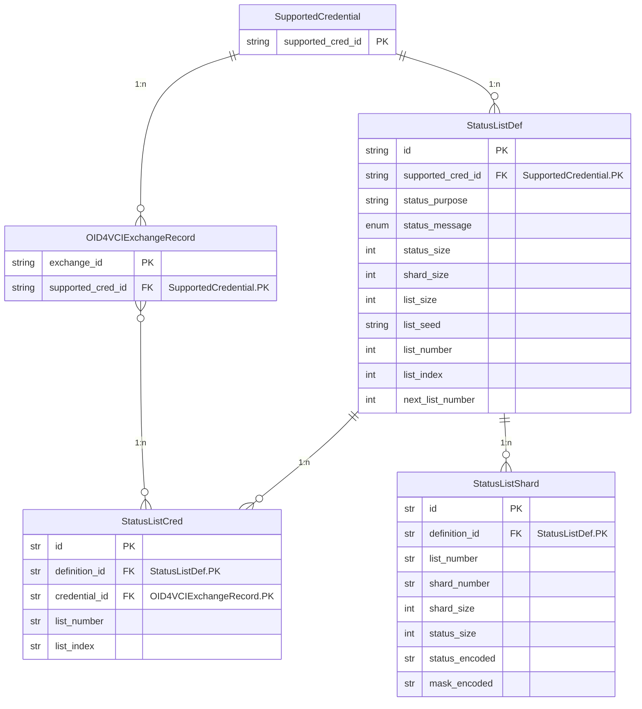
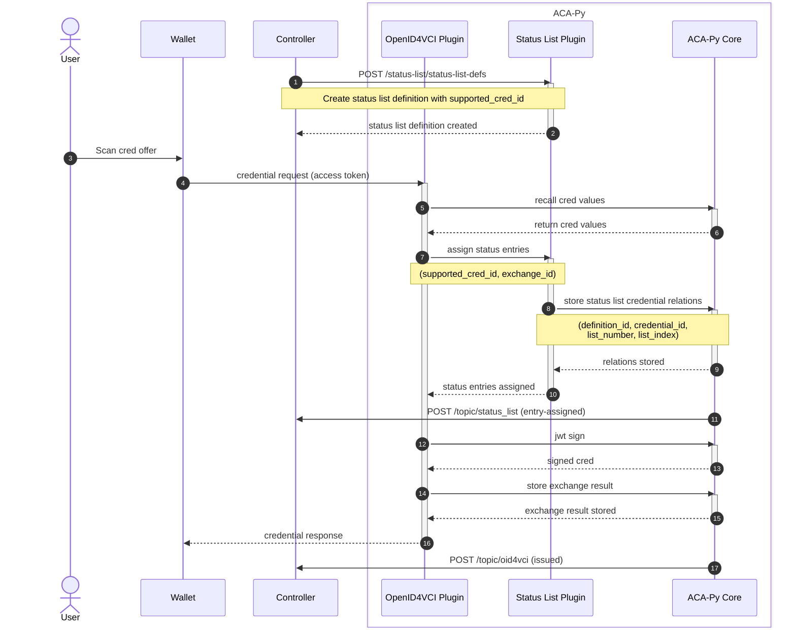
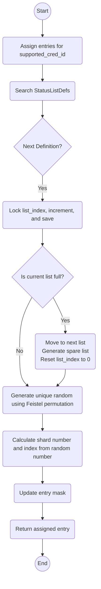

# Status List Plugin for ACA-Py

This plugin implements the [W3C Bitstring Status List v1.0](https://www.w3.org/TR/vc-bitstring-status-list/), a standard for efficiently managing and verifying the status of credentials using bitstring-based lists. It also supports the [IETF Token Status List](https://datatracker.ietf.org/doc/draft-ietf-oauth-status-list/), which provides a mechanism for maintaining the status of OAuth tokens in a scalable and interoperable manner.

The plugin is designed to facilitate streamlined status management for various use cases, including credential revocation, token expiration, and state tracking. However, as it is still under active development, it should be considered experimental and may undergo significant changes. Feedback and contributions are welcome to help improve its functionality and stability.

## Architecture

### Example Deployment


### Data Model

The plugin adds three records to ACA-Py, `StatusListDef`, `StatusListShard` and `StatusListCred`.



### Admin Routes

The Admin API Routes can be found under `/api/docs` of the Admin Server in the `status-list` section.

### How it works

#### Credential Issuance



#### Status List Assignment

When a new status list definition is created, two status lists are generated simultaneously. The assignment flow outlined below assumes this behavior.



#### Performance Considerations

- **Spare List**  
    The plugin maintains a spare status list as a backup to ensure seamless transitions. When the current status list becomes full, the plugin automatically switches to the spare list. Simultaneously, it generates a new spare list in the background, ensuring there is always a backup available and minimizing downtime.

- **Sharding**  
    Sharding is used to optimize performance and manage data efficiently by dividing it into smaller segments. 
    - **Single bit per record**: Each record uses one bit, minimizing space but limiting functionality.  
    - **All bits per record**: All bits are allocated per record, allowing more granular tracking or states.  
    - **Configurable number of bits per record**: The plugin allows flexibility to balance between space efficiency and the need for additional functionality.

- **Deterministic Randomization**  
    A Feistel permutation algorithm is employed with a unique seed assigned to each status list. This ensures that randomization is deterministic and reproducible, reducing collisions and maintaining consistent performance.

- **Entry Lock and Release**  
    The `list_index` serves as the single access point for assignments. Instead of locking the entire assignment process, which could lead to performance bottlenecks, the plugin implements incremental locking. This ensures that only the necessary portion of the operation is locked, improving concurrency and reducing delays.


## Usage

### Configuration

The Plugin expects the following configuration options. These options can either be set by environment variable (`STATUS_LIST_*`) or by plugin config value (`-o status_list.*`).

- `STATUS_LIST_SIZE` or `status_list.list_size`
    - Number of status entries of the status list
- `STATUS_LIST_SHARD_SIZE` or `status_list.shard_size`
    - Number of status entries of each shard
- `STATUS_LIST_BASE_URL` or `status_list.base_url`
    - Base URL of published status lists
- `STATUS_LIST_BASE_DIR` or `status_list.base_dir`
    - Base directory of the local storage
- `STATUS_LIST_PATH_TEMPLATE` or `status_list.path_template`
    - Template string format of status list's sub path

## Contributing

This project is managed using Poetry. To get started:

```shell
poetry install
poetry run pre-commit install
poetry run pre-commit install --hook-type commit-msg
```

### Unit Tests

To run unit tests:

```shell
poetry run pytest tests/
```

### Integration Tests

