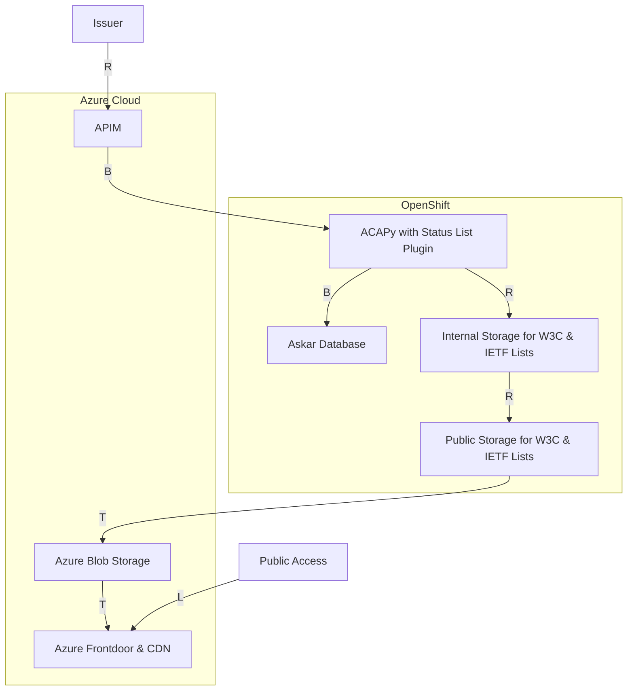
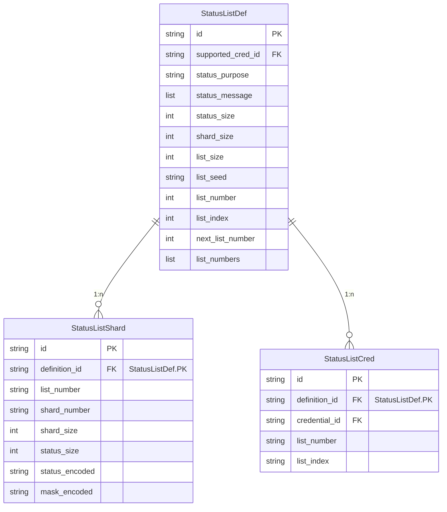
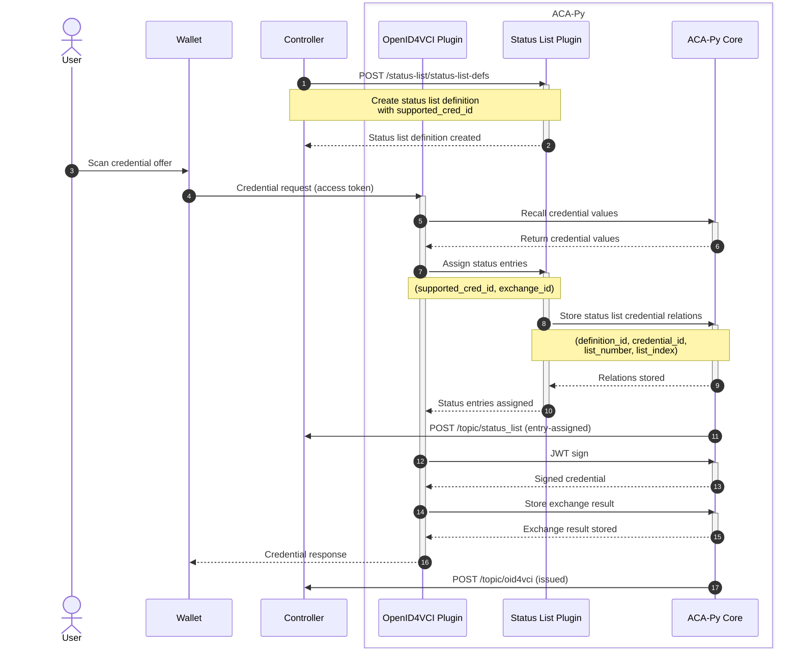
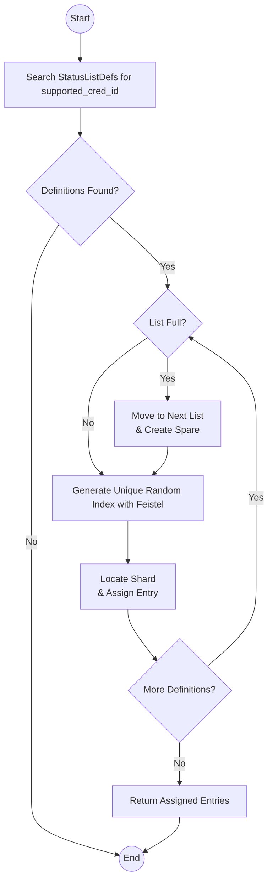

# Status List Plugin for ACA-Py

This plugin implements the [W3C Bitstring Status List v1.0](https://www.w3.org/TR/vc-bitstring-status-list/), a standard for efficiently managing and verifying credential statuses using bitstring-based lists. It also supports the [IETF Token Status List](https://datatracker.ietf.org/doc/draft-ietf-oauth-status-list/), enabling scalable and interoperable OAuth token status management.

Designed for streamlined status tracking, the plugin facilitates credential revocation, token expiration, and other state management use cases. As it remains under active development, it is considered experimental and subject to change. Feedback and contributions are encouraged to enhance its functionality and stability.

## Architecture

### Example Deployment



### Data Model

The plugin adds three records to ACA-Py, `StatusListDef`, `StatusListShard` and `StatusListCred`.



### Admin Routes

The Admin API Routes can be found under `/api/docs` of the Admin Server in the `status-list` section.

### How it works

#### Credential Issuance



#### Status List Assignment

When a new status list definition is created, two status lists are generated simultaneously. The assignment flow outlined below assumes this behavior.



#### Performance Considerations

- **Spare List**  
  The plugin maintains a spare status list to ensure seamless transitions. When the current list is full, it automatically switches to the spare while generating a new one in the background. This guarantees continuous availability and minimizes downtime.

- **Sharding**  
  Sharding improves performance by dividing data into smaller, manageable segments. The plugin supports configurable bits per shard, allowing a balance between space efficiency and functionality.

- **Deterministic Randomization**  
  A Feistel permutation algorithm, seeded uniquely for each status list, ensures deterministic and reproducible randomization. This reduces collisions and maintains consistent performance.

- **Entry Locking & Concurrency**  
  The `list_index` serves as the access point for assignments. Instead of locking the entire process—risking performance bottlenecks—the plugin uses **incremental locking**, ensuring only necessary operations are locked. This improves concurrency and reduces delays.

## Usage

### Configuration

The plugin requires the following configuration options, which can be set either as environment variables (`STATUS_LIST_*`) or as plugin configuration values (`-o status_list.*`).

| **Environment Variable** | **Plugin Config Option** | **Description**                                                                                           |
| ------------------------ | ------------------------ | --------------------------------------------------------------------------------------------------------- |
| `STATUS_LIST_SIZE`       | `status_list.list_size`  | Number of status entries in each status list.                                                             |
| `STATUS_LIST_SHARD_SIZE` | `status_list.shard_size` | Number of status entries in each shard.                                                                   |
| `STATUS_LIST_PUBLIC_URI` | `status_list.public_uri` | Template URI for published status lists with placeholders like {tenant_id} and {list_number}.             |
| `STATUS_LIST_FILE_PATH`  | `status_list.file_path`  | Template local file path for published status lists with placeholders like {tenant_id} and {list_number}. |

### Unit Tests

To run unit tests:

```shell
poetry run pytest tests/
```

### Integration Tests

To run integration tests, execute the following commands:

```shell
cd integration
docker compose build
docker compose up
```

## Contributing

This project is managed using Poetry. To get started:

```shell
poetry install
poetry run pre-commit install
poetry run pre-commit install --hook-type commit-msg
```
