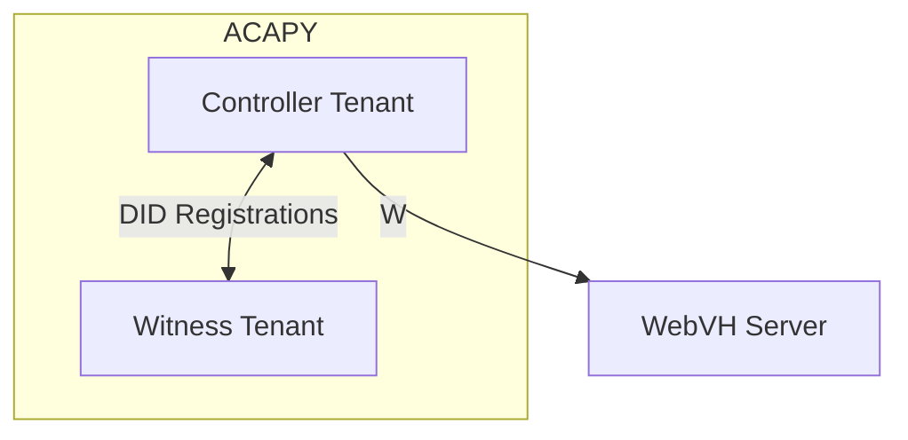
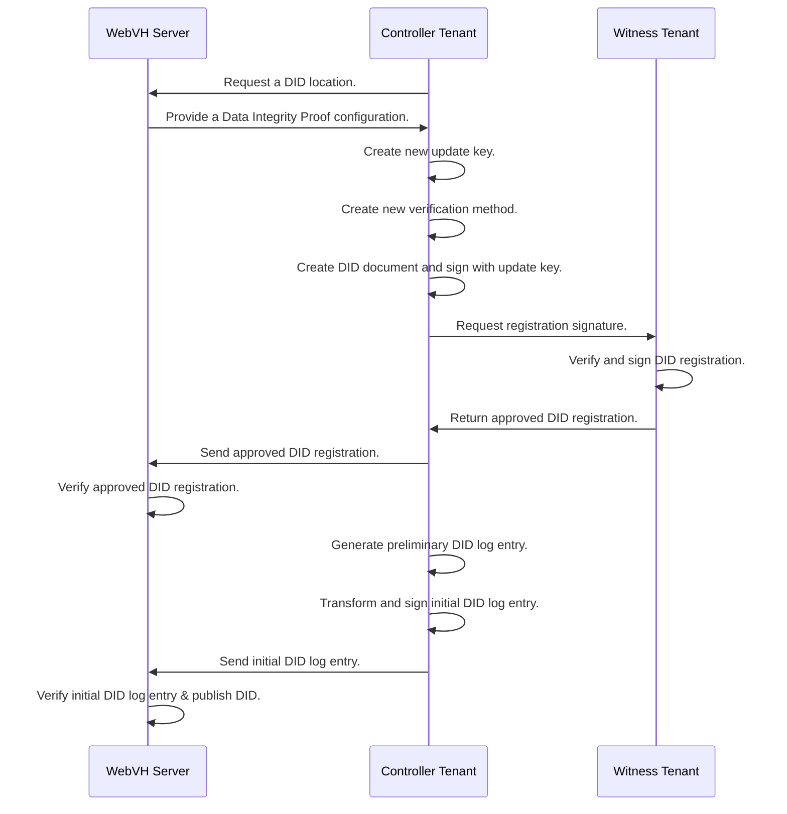

# DID WebVH Plugin

## Description

This plugin provides support for the webvh did method. It provides a controller role that interacts with a did webvh server to resolve and create dids, and a witness role that interacts with the did controller to sign did registrations and updates.

## Architecture



### Components
 - `server` - The server component is responsible for handling requests from the did controller and witness components. It is responsible for verifying the upload requests are signed by proof a trusted source and hosting the did.json and did.jsonl files.
 - `controller` - The controller is the agent or tenant that is responsible for the did. It can create and update webvh dids and anoncreds objects and interact with other agents. The controller does not have the ability to sign with the key that is verified by the server, and needs to get a proof from an agent which does have the correct key(s).
- `witness` - The witness is the agent or tenant that is responsible for signing requests from the controller. The witness has the ability to sign with the key that is verified by the server, and can provide a proof to the controller that it is a trusted source. It can also create dids and anoncreds objects itself and act as a controller by self signing the upload requests with the server.

#### Server
The server used by this plugin is located at [DIF](https://github.com/decentralized-identity/didwebvh-server-py). For a witness signature to be approved, the witness key needs to be registered as a `known-witness` by the server administration. It will only allow dids to be created where the original request is signed by a `known-witness`. After the initial did is created the update key from the controller is obtained from the original request and stored by the server. This update key must be used in the initial log entry.

## Flow

### Creating a new DID


## Configuration

The first step is to configure the plugin for your wallet / subwallet. You can configure it as a Witness or a Controller.
The configuration endpoint takes the following parameters:
 - auto_attest - If true the witness will automatically sign any requests from the controller. If false the witness will need to sign the requests manually.
 - server_url - The url of the server that the witness is using.
 - witness - If true the agent will be setup as a witness agent.
 - witness_key - If a public multikey is provided it will be used instead as the witness signing key.
 - witness_invitation - An invitation provided by a witness.

A Witness will be able to self witness transactions and also act as a Controller. 
A Controller will need a Witness connection to witness it's transactions.

Controllers create DIDs, Witness approve DID registrations and updates.

### Configure a Witness instance

To configure a witness, you need to provide the webvh server url. 
The witness key that is used by the server to authenticate any new dids.

`POST /did/webvh/configuration`
```json
{
    "server_url": "https://example.com",
    "witness": true
}
```

In the response, you will get the public multikey value of the witness. This key must then be registered as a known-witness on the webvh server instance.
You can then create a witness invitation.

`POST /did/webvh/witness/invitations`
```json
{
  "alias": "<alias for the remote controller>",
  "label": "<label for the witness service>"
}
```

In the response, you will get the `invitation_url` which can be forwarded to a controller for its configuration.

### Configure a Controller instance

To configure a controller, you need to provide the webvh server url and a witness invitation,

`POST /did/webvh/configuration`
```json
{
    "server_url": "https://example.com",
    "witness_invitation": "<invitation_url>"
}
```

You should get a status success response and the controller logs should say `Connected to witness agent`

### Creating a DID

When creating a did, you need to provide at the minimum a namespace. An alias can optionally be provided otherwise a random uuid will be generated.

The resulting did will use these values as such:
`did:webvh:<SCID>:<server_url_domain>:<namespace>:<alias>`

Given a `server_url` of `https://example.com`, a full example for the `demo` `namespace` and the `01` `alias` would look like:
`did:webvh:<SCID>:example.com:demo:01`

The parameters values can be opted out to their default.

`POST /did/webvh/controller/create`
```json
{
  "options": {
    "alias": "01",
    "namespace": "demo"
  }
}
```

 - alias - The alias for the did. If this isn't provided it will be a randomly generated uuid.
 - namespace - This is required and is the root alias for the did.
 - parameters - This is an optional object that can be used to set the did to be portable or prerotated. If portable is true the did will be able to be moved to another server. If prerotation is true the did will be able to be rotated by the controller.

#### Auto attest response

This setting should be used with caution as it will automatically sign any requests from the controller. If you are using this setting it should be for testing purposes, or you should be sure any agent that creates a connection with the witness agent is trusted.

Response - Unless there's a problem connecting with the witness or server you should get a success response with the did document.
```json
{
  "@context": [
    "https://www.w3.org/ns/did/v1",
    "https://www.w3.org/ns/cid/v1"
  ],
  "id": "did:webvh:{SCID}:example.com:demo:01",
  "authentication": [
    "did:webvh:{SCID}:example.com:demo:01#z6Mkv4ZvmGpzfkxH9xvNq5mA3zwZoHuBisiQUyfCgXCfHeh4"
  ],
  "assertionMethod": [
    "did:webvh:{SCID}:example.com:demo:01#z6Mkv4ZvmGpzfkxH9xvNq5mA3zwZoHuBisiQUyfCgXCfHeh4"
  ],
  "verificationMethod": [
    {
      "id": "did:webvh:{SCID}:example.com:demo:01#z6Mkv4ZvmGpzfkxH9xvNq5mA3zwZoHuBisiQUyfCgXCfHeh4",
      "type": "Multikey",
      "controller": "did:webvh:{SCID}:example.com:demo:01",
      "publicKeyMultibase": "z6Mkv4ZvmGpzfkxH9xvNq5mA3zwZoHuBisiQUyfCgXCfHeh4"
    }
  ]
}
```

#### Manual attest response

```json
{
  "status": "pending",
  "message": "The witness is pending."
}
```

Witness get pending registrations - `GET /did/webvh/witness/registrations`
```json
{
  "results": [
    {
      "@context": [
        "https://www.w3.org/ns/did/v1",
        "https://w3id.org/security/multikey/v1"
      ],
      "id": "did:web:example.com:demo:01",
      "verificationMethod": [
        {
          "id": "did:web:example.com:demo:01#z6Mkv4ZvmGpzfkxH9xvNq5mA3zwZoHuBisiQUyfCgXCfHeh4",
          "type": "Multikey",
          "controller": "did:web:example.com:demo:01",
          "publicKeyMultibase": "z6Mkv4ZvmGpzfkxH9xvNq5mA3zwZoHuBisiQUyfCgXCfHeh4"
        }
      ],
      "authentication": [
        "did:web:example.com:demo:01#z6Mkv4ZvmGpzfkxH9xvNq5mA3zwZoHuBisiQUyfCgXCfHeh4"
      ],
      "assertionMethod": [
        "did:web:example.com:demo:01#z6Mkv4ZvmGpzfkxH9xvNq5mA3zwZoHuBisiQUyfCgXCfHeh4"
      ],
      "proof": [
        {
          "type": "DataIntegrityProof",
          "proofPurpose": "assertionMethod",
          "verificationMethod": "did:key:z6MkkiMtuEqx8NJcJTTWANmwfpAxZM54jy9Sv867xCN63tpT#z6MkkiMtuEqx8NJcJTTWANmwfpAxZM54jy9Sv867xCN63tpT",
          "cryptosuite": "eddsa-jcs-2022",
          "expires": "2025-02-20T22:43:40+00:00",
          "domain": "example.com",
          "challenge": "6c0bbc23-be56-5f35-b873-3313c33b319b",
          "proofValue": "z9T5HpCDZVZ1c3LgM5ctrYPm2erJR8Ww9o369577beiHc4Dz49See8t78VioPDt76AbRP7r2DnesezY4dBxYTVQ7"
        }
      ]
    }
  ]
}
``` 
Gets a list of pending did docs that need to be attested. 

Witness - Attest a did doc - `POST /did/webvh/witness/registrations?id=did:web:example.com:demo:01`
```json
{
  "status": "success",
  "message": "Witness successful."
}
```

Controller - The controller gets a message `Received witness response: attested` and will finish creating the did. The did should now be resolvable and available in local storage.

## Protocols

### Connecting to a witness service

Once the controller is configured with a `server_url` and a `witness_id`, it can automatically discover and connect to a witness service:

- **Server discovery**: The controller calls the WebVH server’s `/.well-known/did.json` via `WebVHServerClient.get_witness_services()` to obtain the list of witness services.
- **Service selection**: It locates the service whose `id` matches the configured `witness_id`.
- **Invitation resolution**: The controller reads the `serviceEndpoint` field from that service, which MUST be an out-of-band invitation URL (`... ?oob=...`).
- **Connection establishment**: The controller passes this invitation URL to `OutOfBandManager.receive_invitation(...)` to create and/or reuse a DIDComm connection to the witness.

### Requesting a DID path

To request a new DID path (domain + namespace + alias) from the WebVH server:

- **Request**: The controller calls `WebVHServerClient.request_identifier(namespace, alias)`, which translates to an HTTP `GET` on:
  - `GET {server_url}?namespace={namespace}&alias={alias}`
- **Server response**: The server returns a JSON containing:
  - `parameters`: Method parameters **and server policies** that must be applied when creating the DID:
    - `method` – the DID method identifier (e.g. `did:webvh:1.0`) that tells the controller which rules to follow.
    - `witness.threshold` – the minimum number of witnesses that must attest each log entry.
    - `witness.witnesses` – the list of witness identifiers (`id` values) that are allowed to attest for this DID.
    - `watchers` – a list of mandatory watcher service URLs that should be notified on updates.
    - `portability` – if `true`, the DID must be created as portable so it can be migrated between servers.
    - `nextKeyHashes` – if present (as an empty list), indicates that prerotation is required and a `nextKeyHash` must be provisioned.
  - `state.id`: A placeholder DID of the form `did:webvh:{SCID}:{domain}:{namespace}:{alias}`.

This response is then used to create the preliminary DID document, update keys, and initial log entry.

### Creating a log entry

Log entries represent the DID’s history on the WebVH server:

- **Preliminary document**: The controller builds a preliminary DID document with a fresh signing key, default authentication/assertion methods, and any requested DIDComm service entries.
- **Parameters**: It computes the method parameters (e.g. portability, witness threshold, watcher list, update/next keys).
- **Initial log entry**: Using `DocumentState.initial(...)`, the controller constructs the first history line (log entry) and signs it with the configured update key.
- **Witnessing**:
  - If the method requires a witness, the controller sends a witness request to the configured witness (self-witnessing or remote).
  - The witness returns a Data Integrity Proof over the log entry’s `versionId`, or the controller waits for an attestation event.
- **Publishing**: The controller calls `WebVHServerClient.submit_log_entry(log_entry, witness_signature)` to POST the log entry to the server.

Subsequent updates (e.g. key rotation, deactivation) follow the same pattern using `DocumentState.create_next(...)` to generate the next history line.

### Uploading an attested resource

Generic attested resources (such as schemas, status lists, or other linked objects) follow a similar witness workflow:

- **Preparation**: The controller (or resource author) builds the resource payload and signs it as required.
- **Witnessing**:
  - For self-witnessing, the witness adds its own Data Integrity Proof directly to the resource.
  - For remote witnessing, the author sends an attested resource witness request; the witness verifies the proof and appends its own proof.
- **Upload**: The author (or witness, depending on the flow) calls `WebVHServerClient.upload_attested_resource(...)`, which POSTs to the WebVH server:
  - `POST {server_url}/{namespace}/{alias}/resources`
  - Body: `{ "attestedResource": <attested_resource_with_witness_proof> }`
- **Notification**: If watcher notifications are enabled, the controller uses `WebVHWatcherClient.notify_watchers(...)` to inform any configured watchers that a new resource has been published.

### Updating WHOIS

WHOIS data is published as a dedicated attested Verifiable Presentation (VP) linked to a DID:

- **Preparation**:
  - The controller (as holder) builds a WHOIS VP with `holder` set to the controller DID and one or more VCs describing WHOIS attributes.
  - The presentation may already contain proofs on individual VCs (the controller can optionally verify these).
- **Controller signing**:
  - The controller overwrites the `holder` field to ensure it matches the controller DID.
  - It then signs the VP using its DID authentication key (Data Integrity Proof with proofPurpose `authentication`).
- **Upload to server**:
  - The controller calls `update_whois` (ACAPy admin API), which internally invokes `WebVHServerClient.submit_whois(...)`.
  - This results in a server call:
    - `POST {server_url}/{namespace}/{alias}/whois`
    - Body: `{ "verifiablePresentation": <whois_vp_with_controller_proof> }`
- **Result**:
  - The WHOIS VP becomes the authoritative WHOIS record for that DID on the WebVH server and can be resolved by clients that understand the WHOIS extension.

### Updating a DID

When updating a DID, you will usually modify the webvh parameters, add/remove a verification method or edit the services.

#### Updating the verification methods

`POST /did/webvh/controller/verification-methods`
```json
{
    "type": "Multikey",
    "relationships": [
        "authentication",
        "assertionMethod"
    ]
}
```

 - `id` - An optional key id to use, defaults to a public multikey or jwk thumbprint depending on the type.
 - `type` - The key representation in the DID document, can be `Multikey` or `JsonWebKey`.
 - `multikey` - Optionally use an existing local keypair. Otherwise create a new one.
 - `relationships` - Add the relationships for this key. Refer to the DID core specification for more information about relationships.